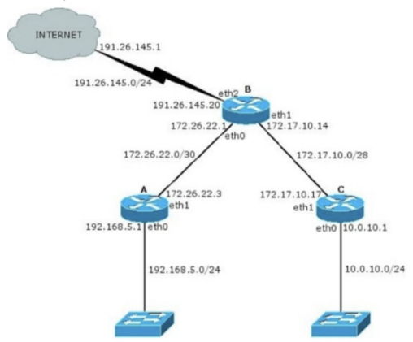
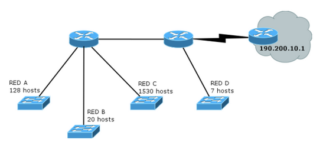
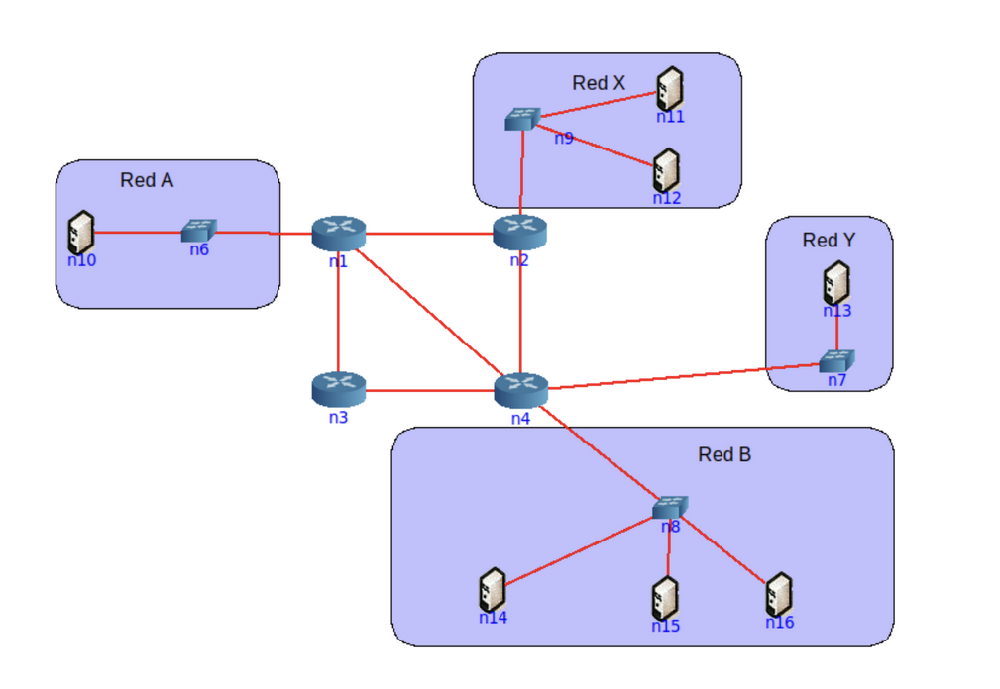

# Práctica 7 - Capa de Red: Direccionamiento

# Introducción

## 1. ¿Qué servicios presta la capa de red? ¿Cuál es la PDU en esta capa? ¿Qué dispositivo es considerado sólo de la capa de red?

La capa de red presta los servicios de **viaje de paquetes** desde un host origen hacia un host destino, a través de las redes.

Asigna **direcciones IP** a las interfaces, permitiendo identificar de forma única los puntos de acceso a la red. También determina los **caminos** por el que deben viajar los datagramas para llegar a su destino, mediante **forwarding** (hop-by-hop) y **ruteo** (por tablas). Otro de los servicios que ofrece es la **multiplexación/demultiplexación** para los datagramas de las capas superiores, además de **fragmentación** y **reensamblado** (para los datagramas que exceden la MTU de los enlaces).

Aparte de estos servicios, el protocolo IP cuenta con _helpers_, ya que es un protocolo _best-effort_.

La PDU de la capa de red es el **_datagrama IP_**.

El dispositivo que se considera exclusivamente de la capa de red es el **_router_**, que realiza el ruteo y el forwarding. No procesa protocolos de enlace ni de transporte.

## 2. ¿Por qué se lo considera un protocolo de mejor esfuerzo?

Al protocolo IP se lo considera best-effort, ya que no garantiza ni entrega, ni ausencia de duplicados, ni orden, ni reintenta envíos, sino que delega todas estas cosas complejas a la capa de transporte.

## 3. ¿Cuántas redes clase A, B y C hay? ¿Cuántos hosts como máximo pueden tener cada una?

### Clase A

**Rango:** `0.0.0.0` hasta `127.255.255.255`

**Cantidad de redes:** 128 redes (2^7)

**Explicación de bits:**

- Primer octeto (0-127) = 2^7 = 128 valores
- El primer bit siempre es 0 para identificar Clase A
- Bits disponibles para red: 7 bits (en el primer octeto)
- Bits disponibles para hosts: 24 bits (octetos 2, 3 y 4 completos)

**Máximo de hosts por red:** 2^24 - 2 = **16,777,214 hosts** (restando la dirección de red y broadcast)

**Estructura binaria:**

```bash
0xxxxxxx.xxxxxxxx.xxxxxxxx.xxxxxxxx
(7 bits)  (8 bits)  (8 bits)  (8 bits)
   Red (7 bits)        Hosts (24 bits)
```

### Clase B

**Rango:** `128.0.0.0` a `191.255.255.255`

**Cantidad de redes:** 2^14 = 16,384 redes

**Explicación de bits:**

- Primeros dos octetos definen la red
- Primer octeto (128-191) = 2^6 = 64 valores
- Segundo octeto (0-255) = 2^8 = 256 valores
- Total: 2^6 × 2^8 = 2^14 redes
- Los primeros 2 bits siempre son 10 para identificar Clase B
- Bits disponibles para hosts: 16 bits (octetos 3 y 4 completos)

**Máximo de hosts por red:** 2^16 - 2 = **65,534 hosts**

**Estructura binaria:**

```bash
10xxxxxx.xxxxxxxx.xxxxxxxx.xxxxxxxx
(6 bits)  (8 bits)  (8 bits)  (8 bits)
   Red (14 bits)        Hosts (16 bits)
```

### Clase C

**Rango:** `192.0.0.0` a `223.255.255.255`

**Cantidad de redes:** 2^21 = 2,097,152 redes

**Explicación de bits:**

- Primeros tres octetos definen la red
- Primer octeto (192-223) = 2^5 = 32 valores
- Segundo octeto (0-255) = 2^8 = 256 valores
- Tercer octeto (0-255) = 2^8 = 256 valores
- Total: 2^5 × 2^8 × 2^8 = 2^21 redes
- Los primeros 3 bits siempre son 110 para identificar Clase C
- Bits disponibles para hosts: 8 bits (octeto 4 completo)

**Máximo de hosts por red:** 2^8 - 2 = **254 hosts**

**Estructura binaria:**

```bash
110xxxxx.xxxxxxxx.xxxxxxxx.xxxxxxxx
(5 bits)  (8 bits)  (8 bits)  (8 bits)
   Red (21 bits)        Hosts (8 bits)
```

### Resumen comparativo:

| Clase | Rango                       | Redes     | Bits Red | Bits Host | Hosts/Red  |
| ----- | --------------------------- | --------- | -------- | --------- | ---------- |
| A     | 0.0.0.0 - 127.255.255.255   | 128       | 7        | 24        | 16,777,214 |
| B     | 128.0.0.0 - 191.255.255.255 | 16,384    | 14       | 16        | 65,534     |
| C     | 192.0.0.0 - 223.255.255.255 | 2,097,152 | 21       | 8         | 254        |

## 4. ¿Qué son las subredes? ¿Por qué es importante siempre especificar la máscara de subred asociada?

### Concepto

Una **subred** es una **división lógica** de una red IP mayor. Surge a partir de la **toma de bits del campo de host para extender la porción de red** y crear redes más pequeñas dentro de la red original.

**Ventajas de usar subredes:**

- **Administración:** Dividen la red en segmentos independientes más fáciles de gestionar
- **Seguridad:** Permiten aplicar reglas de firewall y aislar tráfico entre departamentos
- **Reducción de broadcast:** Cada subred tiene su propio dominio de broadcast, reduciendo congestión
- **Optimización de direcciones:** Mejor aprovechamiento del espacio IP
- **Simplificación de ruteo:** Los routers pueden tomar decisiones basadas en subredes

### Ejemplo práctico de subnetting

**Red original:** `192.168.1.0/24` (máscara `255.255.255.0`)

- Estructura: `11000000.10101000.00000001.xxxxxxxx`
- Bits de host disponibles: 8
- Total de hosts: 2^8 - 2 = **254 hosts en una sola red**

**Necesidad:** Dividir en 3 subredes para tres departamentos diferentes

**Solución:** Tomar 2 bits del campo de host → /26 (máscara `255.255.255.192`)

- Estructura: `11000000.10101000.00000001.xxxxxx|xx`
- Bits para subred: 2 (permite 2^2 = **4 subredes**)
- Bits para hosts: 6 (permite 2^6 - 2 = **62 hosts por subred**)

**Resultado - 4 subredes creadas:**

| Subred | Dirección Red      | Rango de Hosts                    | Broadcast       |
| ------ | ------------------ | --------------------------------- | --------------- |
| 1      | `192.168.1.0/26`   | `192.168.1.1` - `192.168.1.62`    | `192.168.1.63`  |
| 2      | `192.168.1.64/26`  | `192.168.1.65` - `192.168.1.126`  | `192.168.1.127` |
| 3      | `192.168.1.128/26` | `192.168.1.129` - `192.168.1.190` | `192.168.1.191` |
| 4      | `192.168.1.192/26` | `192.168.1.193` - `192.168.1.254` | `192.168.1.255` |

Ahora puedes asignar:

- Departamento 1 → Subred 1 (62 hosts)
- Departamento 2 → Subred 2 (62 hosts)
- Departamento 3 → Subred 3 (62 hosts)
- Reserva → Subred 4

### ¿Por qué es CRÍTICO especificar la máscara?

La dirección IP **por sí sola no tiene significado sin la máscara**. La máscara es lo que indica qué bits representan la red y cuáles el host.

**Ejemplo:**

Tienes la dirección `192.168.1.100`

**Con máscara /24 (`255.255.255.0`):**

```
192.168.1.100/24
└─ Red: 192.168.1.0
└─ Host válido en la red 192.168.1.0 ✓
└─ Broadcast: 192.168.1.255
└─ Rango de hosts: 192.168.1.1 - 192.168.1.254
```

**Con máscara /26 (`255.255.255.192`):**

```
192.168.1.100/26
└─ Red: 192.168.1.64 (porque 100 cae en el bloque 64-127)
└─ Host válido en la red 192.168.1.64 ✓
└─ Broadcast: 192.168.1.127
└─ Rango de hosts: 192.168.1.65 - 192.168.1.126
```

**Con máscara /30 (`255.255.255.252`):**

```
192.168.1.100/30
└─ Red: 192.168.1.100 (porque 100 cae en el bloque 100-103)
└─ Host válido en la red 192.168.1.100 ✓
└─ Broadcast: 192.168.1.103
└─ Rango de hosts: 192.168.1.101 - 192.168.1.102
```

**La misma dirección IP (192.168.1.100) pertenece a DIFERENTES redes según la máscara.**

### Conclusión

La **máscara de subred es inseparable de la dirección IP**. Define:

- Cuántos bits identifican la red
- Cuántos bits identifican al host
- Cuántos hosts caben en esa subred
- Cuál es la dirección de broadcast
- Cuál es el rango válido de direcciones

Sin máscara, una dirección IP es **incompleta e ininterpretable**.

## 5. ¿Cuál es la finalidad del campo Protocol en la cabecera IP? ¿A qué campos de la capa de transporte se asemeja en su funcionalidad?

El campo `Protocol` en la cabecera IP, de 8 bits, indica **a qué protocolo de la capa superior debe entregarse** el paquete IP una vez llega al destino. Se usa para la multiplexación/demultiplexación de datagramas entre capas.

Ésta funcionalidad **se asemeja a los puertos** de la capa de transporte en TCP y UDP, ya que éstos permiten la demultiplexación entre procesos, y `Protocol` permite la demultiplexación entre protocolos.

# División en subredes

## 6. Para cada una de las siguientes direcciones IP (172.16.58.223/26, 163.10.5.49/27, 128.10.1.0/23, 10.1.0.0/24, 8.40.11.179/12) determine:

### a. ¿De qué clase de red es la dirección dada (Clase A, B o C)?

### b. ¿Cuál es la dirección de subred?

### c. ¿Cuál es la cantidad máxima de hosts que pueden estar en esa subred?

### d. ¿Cuál es la dirección de broadcast de esa subred?

### e. ¿Cuál es el rango de direcciones IP válidas dentro de la subred?

#### 172.16.58.223/26

**Clase:** B (primer octeto `172` está entre 128-191)

**Máscara:** `255.255.255.192` → /26 significa 26 bits para red, 6 bits para hosts

**Cálculo de subred:** Con máscara `255.255.255.192`, el último octeto tiene bloques de tamaño 64 (256-192=64). Buscando en qué bloque cae 223: 0-63, 64-127, 128-191, **192-255** ✓

**Dirección de subred:** `172.16.58.192/26`

**Hosts por subred:** 2^6 - 2 = **62 hosts** (64 direcciones totales menos red y broadcast)

**Broadcast:** `172.16.58.255`

**Rango válido:** `172.16.58.193` - `172.16.58.254`

#### 163.10.5.49/27

**Clase:** B (primer octeto `163` está entre 128-191)

**Máscara:** `255.255.255.224` → /27 deja 5 bits para hosts

**Cálculo de subred:** El tamaño de bloque es 32 (256-224=32). El valor 49 pertenece al bloque: 0-31, **32-63** ✓, 64-95, ...

**Dirección de subred:** `163.10.5.32/27`

**Hosts por subred:** 2^5 - 2 = **30 hosts**

**Broadcast:** `163.10.5.63`

**Rango válido:** `163.10.5.33` - `163.10.5.62`

#### 128.10.1.0/23

**Clase:** B (primer octeto `128` está entre 128-191)

**Máscara:** `255.255.254.0` → /23 utiliza 9 bits para hosts

**Cálculo de subred:** El tercer octeto maneja bloques de tamaño 2 (256-254=2). El valor 1 cae en el bloque: **0-1** ✓, 2-3, 4-5, ...

**Dirección de subred:** `128.10.0.0/23`

**Hosts por subred:** 2^9 - 2 = **510 hosts**

**Broadcast:** `128.10.1.255`

**Rango válido:** `128.10.0.1` - `128.10.1.254` (abarca dos valores del tercer octeto: 0 y 1)

#### 10.1.0.0/24

**Clase:** A (primer octeto `10` está entre 0-127)

**Máscara:** `255.255.255.0` → /24 asigna 8 bits para hosts

**Cálculo de subred:** Como todos los bits del último octeto son 0, ya estamos en la dirección de subred.

**Dirección de subred:** `10.1.0.0/24`

**Hosts por subred:** 2^8 - 2 = **254 hosts**

**Broadcast:** `10.1.0.255`

**Rango válido:** `10.1.0.1` - `10.1.0.254`

#### 8.40.11.179/12

**Clase:** A (primer octeto `8` está entre 0-127)

**Máscara:** `255.240.0.0` → /12 reserva 20 bits para hosts

**Cálculo de subred:** El segundo octeto trabaja con bloques de 16 (256-240=16). El valor 40 pertenece al bloque: 0-15, 16-31, **32-47** ✓, 48-63, ...

**Dirección de subred:** `8.32.0.0/12`

**Hosts por subred:** 2^20 - 2 = **1,048,574 hosts**

**Broadcast:** `8.47.255.255`

**Rango válido:** `8.32.0.1` - `8.47.255.254`

## 7. Su organización cuenta con la dirección 128.50.10.0. Indique:

### a. ¿Es una dirección de red o de host?

**Es una dirección de host.**

**Análisis:**

- Clase B tiene máscara por defecto /16 (255.255.0.0)
- Porción de red: 128.50 (primeros 16 bits)
- Porción de host: 10.0 (últimos 16 bits)
- Como los bits de host NO son todos ceros, es una dirección de host individual
- Si fuera dirección de red, debería ser 128.50.0.0/16

### b. Clase a la que pertenece y máscara de clase.

**Clase:** B (el primer octeto 128 está en el rango 128-191)

**Máscara de clase:** /16 o 255.255.0.0

**Estructura binaria:**

```
10000000.00110010.xxxxxxxx.xxxxxxxx
   128      50      (host)   (host)
```

### c. Cantidad de hosts posibles.

Con la máscara de clase B por defecto (/16):

**Hosts posibles:** 2^16 - 2 = **65,534 hosts**

(Se restan 2: una dirección para la red y otra para broadcast)

### d. Se necesitan crear, al menos, 513 subredes. Indique:

#### I. Máscara necesaria.

**Cálculo de bits para subredes:**

- Se necesitan al menos 513 subredes
- Buscamos n donde 2^n ≥ 513
    - 2^9 = 512 ✗ (no alcanza)
    - 2^10 = 1024 ✓

**Necesitamos 10 bits para subredes.**

La máscara de clase B es /16, agregamos 10 bits:

- /16 + 10 = **/26**

**Máscara necesaria:** /26 o **255.255.255.192**

#### II. Cantidad de redes asignables.

Con 10 bits dedicados a subredes:

**Cantidad de subredes:** 2^10 = **1,024 subredes**

#### III. Cantidad de hosts por subred.

Con máscara /26:

- Bits totales: 32
- Bits de red y subred: 26
- Bits de host: 32 - 26 = 6

**Hosts por subred:** 2^6 - 2 = **62 hosts**

(Tamaño de bloque: 2^6 = 64 direcciones por subred)

#### IV. Dirección de la subred 710.

**Cálculo:**

Cada subred ocupa 64 direcciones (2^6 = 64).

Las subredes se numeran desde 0, entonces:

- Subred 710 corresponde al **índice 709** (la subred 0 es la primera)

Offset de la subred con índice 709:

- 709 × 64 = 45,376

Distribuyendo en los últimos 16 bits de 128.50.x.y:

- 45,376 ÷ 256 = 177 resto 64
- Tercer octeto: 177
- Cuarto octeto: 64

**Dirección de la subred 710:** `128.50.177.64/26`

**Representación binaria del índice 709:**

```
709 en decimal = 1011000101 en binario (10 bits)
```

**Representación binaria de la dirección completa:**

```
128.      50.       177.      64
10000000. 00110010. 10110001. 01000000
^^^^^^^^  ^^^^^^^^  ^^^^^^^^  ^^------
   Red       Red    Subred    Subred Host
 (clase)  (clase)  (2 bits)  (8 bits)(6)
                    10110001  01

Total: 16 bits red + 10 bits subred + 6 bits host = 32 bits
```

**Verificación:**

- El cuarto octeto 64 en binario = `01000000`
- Los últimos 6 bits son 0 ✓ (es dirección de subred válida)
- Los primeros 26 bits (red+subred) identifican esta subred específica

#### V. Dirección de broadcast de la subred 710.

La subred 710 es `128.50.177.64/26` con bloques de 64:

- Primera dirección: 128.50.177.64 (red)
- Última dirección: 128.50.177.127 (broadcast)
- Próxima subred: 128.50.177.128

**Broadcast de subred 710:** `128.50.177.127`

**Resumen de la subred 710:**

- Red: 128.50.177.64/26
- Primer host: 128.50.177.65
- Último host: 128.50.177.126
- Broadcast: 128.50.177.127
- Hosts utilizables: 62

## 8. Si usted estuviese a cargo de la administración del bloque IP 195.200.45.0/24

### a. ¿Qué máscara utilizaría si necesita definir al menos 9 subredes?

**Red base:** 195.200.45.0/24 (Clase C)

**Cálculo de bits necesarios:**

- Se necesitan al menos 9 subredes
- Buscamos n donde 2^n ≥ 9
    - 2^3 = 8 ✗ (no alcanza)
    - 2^4 = 16 ✓

**Necesitamos 4 bits para subredes.**

Nueva máscara: /24 + 4 = **/28**

**Máscara necesaria:** 255.255.255.240 o /28

**Representación binaria de la máscara /28:**

```bash
255.      255.      255.      240
11111111. 11111111. 11111111. 11110000
^^^^^^^^  ^^^^^^^^  ^^^^^^^^  ^^^^----
   Red       Red       Red     Subred Host
 (clase)  (clase)  (clase)   (4 bits)(4)
```

**Características de las subredes:**

- Subredes disponibles: 2^4 = **16 subredes**
- Tamaño de bloque: 2^4 = **16 direcciones por subred**
- Hosts por subred: 2^4 - 2 = **14 hosts utilizables**

### b. Indique la dirección de subred de las primeras 9 subredes.

Las primeras 9 subredes con tamaño de bloque 16:

| Subred | Dirección Decimal | Dirección Binaria (último octeto)       |
| ------ | ----------------- | --------------------------------------- |
| 0      | 195.200.45.0/28   | 11000011.11001000.00101101.0000**0000** |
| 1      | 195.200.45.16/28  | 11000011.11001000.00101101.0001**0000** |
| 2      | 195.200.45.32/28  | 11000011.11001000.00101101.0010**0000** |
| 3      | 195.200.45.48/28  | 11000011.11001000.00101101.0011**0000** |
| 4      | 195.200.45.64/28  | 11000011.11001000.00101101.0100**0000** |
| 5      | 195.200.45.80/28  | 11000011.11001000.00101101.0101**0000** |
| 6      | 195.200.45.96/28  | 11000011.11001000.00101101.0110**0000** |
| 7      | 195.200.45.112/28 | 11000011.11001000.00101101.0111**0000** |
| 8      | 195.200.45.128/28 | 11000011.11001000.00101101.1000**0000** |

**Explicación binaria:**

- Los primeros 28 bits identifican la subred (mostrados en los primeros 4 bits del último octeto)
- Los últimos 4 bits son para hosts (mostrados en negrita)
- Cada dirección de subred tiene los últimos 4 bits en 0

### c. Seleccione una e indique dirección de broadcast y rango de direcciones asignables en esa subred.

**Subred seleccionada:** Subred 0 (195.200.45.0/28)

**Dirección de red:** 195.200.45.0

```bash
Decimal:  195.      200.      45.       0
Binario:  11000011. 11001000. 00101101. 00000000
```

**Dirección de broadcast:** 195.200.45.15

```bash
Decimal:  195.      200.      45.       15
Binario:  11000011. 11001000. 00101101. 00001111
                                        ^^^^----
                                        Subred Host
                                        (todos 1s)
```

**Cálculo del broadcast:**

- Dirección de red + tamaño de bloque - 1 = 0 + 16 - 1 = 15

**Primera dirección asignable:** 195.200.45.1

```bash
Decimal:  195.      200.      45.       1
Binario:  11000011. 11001000. 00101101. 00000001
```

**Última dirección asignable:** 195.200.45.14

```bash
Decimal:  195.      200.      45.       14
Binario:  11000011. 11001000. 00101101. 00001110
```

**Rango de direcciones asignables:** 195.200.45.1 - 195.200.45.14

**Resumen de la subred 0:**

| Elemento                    | Decimal       | Binario (último octeto) |
| --------------------------- | ------------- | ----------------------- |
| Red                         | 195.200.45.0  | 00000000                |
| Primera asignable           | 195.200.45.1  | 00000001                |
| Segunda asignable           | 195.200.45.2  | 00000010                |
| ...                         | ...           | ...                     |
| Última asignable            | 195.200.45.14 | 00001110                |
| Broadcast                   | 195.200.45.15 | 00001111                |
| **Total hosts utilizables** | **14**        | -                       |

## 9. Dado el siguiente gráfico:



### a. Verifique si es correcta la asignación de direcciones IP y, en caso de no serlo, modifique la misma para que lo sea.

### b. ¿Cuántos bits se tomaron para hacer subredes en la red 10.0.10.0/24? ¿Cuántas subredes se podrían generar?

### c. Para cada una de las redes utilizadas indique si son públicas o privadas.

# CIDR

## 10. ¿Qué es CIDR (Class Interdomain routing)? ¿Por qué resulta útil?

### ¿Qué es CIDR?

**CIDR (Classless Inter-Domain Routing)** es un método de asignación de direcciones IP que **reemplaza el antiguo sistema de clases** (A, B, C). Introducido en 1993, permite una **asignación más flexible y eficiente** del espacio de direcciones IPv4.

**Características principales:**

- **Notación de prefijo:** Usa la notación `/n` donde n indica cuántos bits son parte de la red
- **Sin clases:** No está limitado a las máscaras por defecto (/8, /16, /24)
- **Agregación de rutas:** Permite combinar múltiples redes en una sola entrada de ruteo
- **Subdivisión flexible:** Permite dividir bloques en segmentos de cualquier tamaño

**Ejemplo de notación CIDR:**

```bash
192.168.10.0/24
└─ 192.168.10.0 es la dirección de red
└─ /24 indica que los primeros 24 bits son la parte de red
```

### ¿Por qué resulta útil?

**1. Optimización del espacio de direcciones IPv4**

El sistema de clases desperdiciaba direcciones:

- Clase C (/24): Solo 254 hosts → demasiado pequeña para muchas organizaciones
- Clase B (/16): 65,534 hosts → demasiado grande, desperdicio masivo

Con CIDR puedes asignar exactamente el tamaño que necesitas:

- ¿Necesitas 500 hosts? → /23 (510 hosts)
- ¿Necesitas 30 hosts? → /27 (30 hosts)
- ¿Necesitas 1000 hosts? → /22 (1022 hosts)

**2. Reducción de las tablas de ruteo (Agregación/Supernetting)**

En lugar de publicar múltiples rutas individuales, CIDR permite **agregar rutas contiguas** en una sola entrada.

**Sin CIDR (rutas individuales):**

```bash
Router debe mantener:
- 200.10.0.0/24
- 200.10.1.0/24
- 200.10.2.0/24
- 200.10.3.0/24
(4 entradas de ruteo)
```

**Con CIDR (agregación):**

```bash
Router solo mantiene:
- 200.10.0.0/22
(1 entrada que abarca las 4 redes anteriores)
```

**3. Mayor flexibilidad en asignación**

Permite a los ISPs asignar bloques de tamaño apropiado a cada cliente:

- Empresa pequeña: /29 (6 hosts)
- Empresa mediana: /24 (254 hosts)
- Empresa grande: /20 (4094 hosts)

**4. Jerarquía de direcciones**

Facilita la organización jerárquica del espacio IP, permitiendo agregación a diferentes niveles:

```bash
ISP recibe: 200.100.0.0/16
├─ Cliente 1: 200.100.0.0/20
├─ Cliente 2: 200.100.16.0/20
├─ Cliente 3: 200.100.32.0/20
└─ Reserva: 200.100.48.0/20
```

**5. Extensión de la vida útil de IPv4**

CIDR ha prolongado significativamente la utilidad de IPv4 al reducir el desperdicio de direcciones y el tamaño de las tablas de ruteo globales.

## 11. ¿Cómo publicaría un router las siguientes redes si se aplica CIDR?

### a. 198.10.1.0/24

### b. 198.10.0.0/24

### c. 198.10.3.0/24

### d. 198.10.2.0/24

**Análisis de las redes:**

Las 4 redes son consecutivas en el tercer octeto (0, 1, 2, 3) y todas tienen máscara /24.

**Paso 1: Ordenar las redes**

```bash
198.10.0.0/24
198.10.1.0/24
198.10.2.0/24
198.10.3.0/24
```

**Paso 2: Verificar si son agregables**

Para agregar redes, deben ser:

1. **Consecutivas** ✓ (0, 1, 2, 3)
2. **Del mismo tamaño** ✓ (todas /24)
3. **La primera debe comenzar en un múltiplo del bloque total** ✓

Total de redes: 4 = 2^2 → necesitamos 2 bits menos en la máscara

**Paso 3: Calcular el bloque CIDR agregado**

- Máscara original: /24
- Redes a agregar: 4 = 2^2
- Nueva máscara: /24 - 2 = **/22**

**Paso 4: Verificación en binario**

```bash
198.10.0.0    = 11000110.00001010.00000000.00000000
198.10.1.0    = 11000110.00001010.00000001.00000000
198.10.2.0    = 11000110.00001010.00000010.00000000
198.10.3.0    = 11000110.00001010.00000011.00000000
                                     ^^^^^^
                                     Varían solo los últimos 2 bits

Máscara /22:  11111111.11111111.11111100.00000000
                                     ^^---- (2 bits para las 4 redes)
```

**Respuesta: El router publicaría una sola ruta agregada:**

```bash
198.10.0.0/22
```

**Equivalencia:**

```bash
255.255.252.0 o /22
```

**Rango completo cubierto:**

- Primera red: 198.10.0.0
- Última red: 198.10.3.255
- Total de direcciones: 1024 (4 × 256)

**Ventaja:** En lugar de 4 entradas en la tabla de ruteo, solo se necesita 1 entrada.

## 12. Listar las redes involucradas en los siguientes bloques CIDR:

### Bloque 1: 200.56.168.0/21

**Análisis de /21:**

- Bits de red: 21
- Bits de host: 32 - 21 = 11
- Tamaño del bloque: 2^11 = **2048 direcciones**
- Cantidad de redes /24: 2048 ÷ 256 = **8 redes /24**

**Cálculo del rango:**

El tercer octeto maneja bloques de tamaño 8 (porque /21 toma 5 bits del tercer octeto, dejando 3 bits variables: 2^3 = 8).

**Representación binaria:**

```bash
200.56.168.0/21
          ^^^ = 10101000 en binario
                   ^^^^^--- Fijos (parte de red)
                        ^^^- Variables (8 valores: 0-7)
```

**Cálculo:**

Comenzando en 168, las 8 redes consecutivas son:

```bash
168 + 0 = 168
168 + 1 = 169
168 + 2 = 170
168 + 3 = 171
168 + 4 = 172
168 + 5 = 173
168 + 6 = 174
168 + 7 = 175
```

**Redes involucradas:**

1. 200.56.168.0/24
2. 200.56.169.0/24
3. 200.56.170.0/24
4. 200.56.171.0/24
5. 200.56.172.0/24
6. 200.56.173.0/24
7. 200.56.174.0/24
8. 200.56.175.0/24

**Rango completo:** 200.56.168.0 - 200.56.175.255

---

### Bloque 2: 195.24.0.0/13

**Análisis de /13:**

- Bits de red: 13
- Bits de host: 32 - 13 = 19
- Tamaño del bloque: 2^19 = **524,288 direcciones**
- Cantidad de redes /24: 524,288 ÷ 256 = **2048 redes /24**

**Cálculo del rango:**

El /13 toma solo 5 bits del segundo octeto (8+5=13), dejando 3 bits variables en el segundo octeto: 2^3 = 8 valores.

**Representación binaria:**

```bash
195.24.0.0/13
    ^^ = 00011000 en binario
         ^^^^^--- Fijos (parte de red)
              ^^^- Variables (8 valores: 0-7)
```

**Cálculo:**

Comenzando en 24, los 8 bloques del segundo octeto son:

```bash
24 + 0 = 24   → 195.24.0.0
24 + 1 = 25   → 195.25.0.0
24 + 2 = 26   → 195.26.0.0
24 + 3 = 27   → 195.27.0.0
24 + 4 = 28   → 195.28.0.0
24 + 5 = 29   → 195.29.0.0
24 + 6 = 30   → 195.30.0.0
24 + 7 = 31   → 195.31.0.0
```

**Redes involucradas (resumidas por bloques /16):**

Cada bloque del segundo octeto contiene 256 redes /24:

- **195.24.0.0/24 - 195.24.255.0/24** (256 redes)
- **195.25.0.0/24 - 195.25.255.0/24** (256 redes)
- **195.26.0.0/24 - 195.26.255.0/24** (256 redes)
- **195.27.0.0/24 - 195.27.255.0/24** (256 redes)
- **195.28.0.0/24 - 195.28.255.0/24** (256 redes)
- **195.29.0.0/24 - 195.29.255.0/24** (256 redes)
- **195.30.0.0/24 - 195.30.255.0/24** (256 redes)
- **195.31.0.0/24 - 195.31.255.0/24** (256 redes)

**Total:** 8 × 256 = **2048 redes /24**

**Rango completo:** 195.24.0.0 - 195.31.255.255

---

### Bloque 3: 195.24/13

**Aclaración:** La notación `195.24/13` es equivalente a `195.24.0.0/13`

Cuando se omiten los octetos finales, se asumen como 0.

**Por lo tanto:** Las redes involucradas son **exactamente las mismas** que en el bloque anterior (195.24.0.0/13).

## 13. El bloque CIDR 128.0.0.0/2 o 128/2, ¿Equivale a listar todas las direcciones de red de clase B? ¿Cuál sería el bloque CIDR que agrupa todas las redes de clase A?

### ¿128.0.0.0/2 equivale a todas las redes Clase B?

**Respuesta: NO, es mucho más grande.**

**Análisis del bloque 128.0.0.0/2:**

**Representación binaria:**

```bash
128.0.0.0/2
^^^ = 10000000 en binario
      ^^------- Fijos por /2 (solo 2 bits de red)
        ^^^^^^- Variables (6 bits libres en el primer octeto)

/2 significa:
11000000.00000000.00000000.00000000 (máscara)
^^------ Solo estos 2 bits están fijos
  ^^^^^^ ^^^^^^^^ ^^^^^^^^ ^^^^^^^^ (30 bits variables)
```

**Cálculo del rango:**

Con /2, los primeros 2 bits son `10`, el resto varía:

- Primer bit: 1 (fijo)
- Segundo bit: 0 (fijo)
- Bits 3-32: variables

**Valores del primer octeto:**

```bash
10000000 = 128 (mínimo)
10111111 = 191 (máximo)
```

Pero continúa más allá de 191:

```bash
Primer octeto puede ser: 128-191 (esto es Clase B) ✓
Pero también puede ser: 192-255 (esto incluye Clase C y D) ✓
```

**Rango completo de 128.0.0.0/2:**

- **Inicio:** 128.0.0.0
- **Fin:** 191.255.255.255

**Espera... eso SÍ cubre exactamente Clase B!**

Revisando:

```bash
Clase B: 128.0.0.0 - 191.255.255.255
128 = 10000000
191 = 10111111
      ^^------- Ambos empiezan con "10"
```

**Respuesta corregida: SÍ, 128.0.0.0/2 equivale exactamente a todas las direcciones de Clase B.**

**Verificación:**

- Clase B se define por: primer octeto 128-191
- En binario: todos empiezan con `10`
- /2 captura exactamente esos primeros 2 bits: `10`

**Cantidad de direcciones:**

- Clase B: 2^30 direcciones (64 bloques de 2^24)
- 128.0.0.0/2: 2^30 direcciones
- ✓ Coinciden perfectamente

---

### ¿Cuál sería el bloque CIDR que agrupa todas las redes de clase A?

**Clase A:**

- **Rango:** 0.0.0.0 - 127.255.255.255
- **Primer octeto:** 0-127
- **Característica binaria:** Primer bit es `0`

**Representación binaria:**

```bash
0   = 00000000
127 = 01111111
      ^-------- El primer bit siempre es 0
```

**Bloque CIDR equivalente:**

Para capturar todos los valores donde el primer bit es `0`, necesitamos:

**Respuesta: 0.0.0.0/1**

**Verificación:**

```bash
0.0.0.0/1
Máscara /1: 10000000.00000000.00000000.00000000
            ^------- Solo el primer bit está fijo (debe ser 0)

Rango cubierto:
- Mínimo: 00000000.00000000.00000000.00000000 = 0.0.0.0
- Máximo: 01111111.11111111.11111111.11111111 = 127.255.255.255
```

**Resumen:**

| Clase | Rango               | Bloque CIDR     | Primer(os) bit(s) |
| ----- | ------------------- | --------------- | ----------------- |
| A     | 0.0.0.0-127.x.x.x   | **0.0.0.0/1**   | 0                 |
| B     | 128.0.0.0-191.x.x.x | **128.0.0.0/2** | 10                |
| C     | 192.0.0.0-223.x.x.x | **192.0.0.0/3** | 110               |

# VLSM

## 14. ¿Qué es y para qué se usa VLSM?

**VLSM (Variable Length Subnet Mask)** es una técnica que permite **usar diferentes máscaras de subred dentro de la misma red principal**, asignando bloques de tamaños distintos según las necesidades específicas de cada segmento.

**¿Para qué se usa?**

**1. Optimización de direcciones IP:** Evita el desperdicio asignando el tamaño exacto que necesita cada red.

**Ejemplo sin VLSM:**

- Red 192.168.1.0/24 dividida con /26 para todas las subredes
- Subred A necesita 50 hosts → /26 da 62 hosts ✓
- Subred B necesita 10 hosts → /26 da 62 hosts (desperdicio de 52 direcciones) ✗
- Enlace router-router necesita 2 hosts → /26 da 62 hosts (desperdicio de 60) ✗

**Ejemplo con VLSM:**

- Subred A (50 hosts) → /26 (62 hosts, desperdicio: 12)
- Subred B (10 hosts) → /28 (14 hosts, desperdicio: 4)
- Enlace router-router (2 hosts) → /30 (2 hosts, desperdicio: 0)

**2. Flexibilidad:** Permite adaptar cada subred a su tamaño real sin estar limitado a una única máscara.

**3. Escalabilidad:** Facilita el crecimiento de la red asignando bloques reservados de distintos tamaños.

## 15. Describa, con sus palabras, el mecanismo para dividir subredes utilizando VLSM.

**Mecanismo de división con VLSM:**

**1. Ordenar requerimientos de mayor a menor**

- Lista todas las redes por cantidad de hosts necesarios
- Ordena de mayor a menor para optimizar la asignación

**2. Calcular máscara para cada red**

- Para cada red, determina cuántos bits de host se necesitan
- Busca la potencia de 2 que cumpla: 2^n - 2 ≥ hosts_requeridos
- Calcula la máscara: 32 - n = /prefijo

**3. Asignar direcciones secuencialmente**

- Comienza con la red más grande
- Asigna la primera dirección disponible del bloque original
- Calcula el tamaño de bloque: 2^n direcciones
- La próxima red disponible comienza después del bloque actual

**4. Repetir el proceso recursivamente**

- Para cada red subsiguiente, usa la siguiente dirección libre
- Continúa hasta asignar todas las redes
- Las direcciones restantes quedan disponibles para crecimiento futuro

**Ejemplo práctico:**

Bloque: 192.168.10.0/24

Requerimientos ordenados:

1. Red A: 100 hosts → necesita /25 (126 hosts, bloque de 128)
2. Red B: 50 hosts → necesita /26 (62 hosts, bloque de 64)
3. Red C: 20 hosts → necesita /27 (30 hosts, bloque de 32)
4. Enlace: 2 hosts → necesita /30 (2 hosts, bloque de 4)

Asignación:

- Red A: 192.168.10.0/25 (ocupa 192.168.10.0 - 192.168.10.127)
- Red B: 192.168.10.128/26 (ocupa 192.168.10.128 - 192.168.10.191)
- Red C: 192.168.10.192/27 (ocupa 192.168.10.192 - 192.168.10.223)
- Enlace: 192.168.10.224/30 (ocupa 192.168.10.224 - 192.168.10.227)
- Disponible: 192.168.10.228 - 192.168.10.255 (28 direcciones libres)

## 16. Suponga que trabaja en una organización que tiene la red que se ve en el gráfico y debe armar el direccionamiento para la misma, minimizando el desperdicio de direcciones IP. Dicha organización posee la red 205.10.192.0/19, que es la que usted deberá utilizar.



**Análisis de la topología:**

- **RED A:** 128 hosts
- **RED B:** 20 hosts
- **RED C:** 1530 hosts
- **RED D:** 7 hosts
- **Enlaces entre routers:** 3 enlaces (necesitan 2 hosts cada uno)

**Red base disponible:** 205.10.192.0/19

- Tamaño del bloque /19: 2^13 = **8192 direcciones totales**
- Rango: 205.10.192.0 - 205.10.223.255

### a. ¿Es posible asignar las subredes correspondientes a la topología utilizando subnetting sin VLSM? Indique la cantidad de hosts que se desperdicia en cada subred.

**Sí, es posible pero con mucho desperdicio.**

**Análisis sin VLSM:**

Para subnetting tradicional (sin VLSM), todas las subredes deben usar la **misma máscara**. La máscara debe ser suficiente para la red más grande (RED C con 1530 hosts).

**Cálculo de máscara única:**

- RED C necesita 1530 hosts
- Buscar n donde 2^n - 2 ≥ 1530
    - 2^10 - 2 = 1022 ✗
    - 2^11 - 2 = 2046 ✓
- Máscara necesaria: /32 - 11 = **/21**

**Con máscara /21 fija para todas:**

| Red   | Hosts necesarios | Hosts disponibles (/21) | Desperdicio |
| ----- | ---------------- | ----------------------- | ----------- |
| RED C | 1530             | 2046                    | **516**     |
| RED A | 128              | 2046                    | **1918**    |
| RED B | 20               | 2046                    | **2026**    |
| RED D | 7                | 2046                    | **2039**    |

**Desperdicio total:** 516 + 1918 + 2026 + 2039 = **6499 direcciones desperdiciadas**

**Conclusión:** Es posible pero extremadamente ineficiente. VLSM permite reducir drásticamente este desperdicio.

### b. Asigne direcciones a todas las redes de la topología. Tome siempre en cada paso la primera dirección de red posible.

**Paso 1: Ordenar redes de mayor a menor**

1. RED C: 1530 hosts → necesita /21 (2046 hosts, bloque de 2048)
2. RED A: 128 hosts → necesita /24 (254 hosts, bloque de 256)
3. RED B: 20 hosts → necesita /27 (30 hosts, bloque de 32)
4. RED D: 7 hosts → necesita /28 (14 hosts, bloque de 16)
5. Enlace Router-Router (3 enlaces): 2 hosts c/u → necesita /30 (2 hosts, bloque de 4)

**Paso 2: Asignación secuencial con VLSM**

**RED C (1530 hosts - /21):**

- Dirección de red: **205.10.192.0/21**
- Primera IP asignable: 205.10.192.1
- Última IP asignable: 205.10.199.254
- Broadcast: 205.10.199.255
- Rango ocupado: 205.10.192.0 - 205.10.199.255 (2048 direcciones)

**RED A (128 hosts - /24):**

- Dirección de red: **205.10.200.0/24**
- Primera IP asignable: 205.10.200.1
- Última IP asignable: 205.10.200.254
- Broadcast: 205.10.200.255
- Rango ocupado: 205.10.200.0 - 205.10.200.255 (256 direcciones)

**RED B (20 hosts - /27):**

- Dirección de red: **205.10.201.0/27**
- Primera IP asignable: 205.10.201.1
- Última IP asignable: 205.10.201.30
- Broadcast: 205.10.201.31
- Rango ocupado: 205.10.201.0 - 205.10.201.31 (32 direcciones)

**RED D (7 hosts - /28):**

- Dirección de red: **205.10.201.32/28**
- Primera IP asignable: 205.10.201.33
- Última IP asignable: 205.10.201.46
- Broadcast: 205.10.201.47
- Rango ocupado: 205.10.201.32 - 205.10.201.47 (16 direcciones)

**Enlace 1 (Router izquierdo - Router central):**

- Dirección de red: **205.10.201.48/30**
- IP Router izquierdo: 205.10.201.49
- IP Router central: 205.10.201.50
- Broadcast: 205.10.201.51
- Rango ocupado: 205.10.201.48 - 205.10.201.51 (4 direcciones)

**Enlace 2 (Router central - Router derecho):**

- Dirección de red: **205.10.201.52/30**
- IP Router central: 205.10.201.53
- IP Router derecho: 205.10.201.54
- Broadcast: 205.10.201.55
- Rango ocupado: 205.10.201.52 - 205.10.201.55 (4 direcciones)

**Enlace 3 (Router derecho - Internet 190.200.10.1):**

- Dirección de red: **205.10.201.56/30**
- IP Router derecho: 205.10.201.57
- IP Gateway Internet: 205.10.201.58
- Broadcast: 205.10.201.59
- Rango ocupado: 205.10.201.56 - 205.10.201.59 (4 direcciones)

**Resumen de asignaciones:**

| Red/Enlace | Dirección de Red | Máscara | Hosts útiles | Rango asignable               |
| ---------- | ---------------- | ------- | ------------ | ----------------------------- |
| RED C      | 205.10.192.0/21  | /21     | 2046         | 205.10.192.1 - 205.10.199.254 |
| RED A      | 205.10.200.0/24  | /24     | 254          | 205.10.200.1 - 205.10.200.254 |
| RED B      | 205.10.201.0/27  | /27     | 30           | 205.10.201.1 - 205.10.201.30  |
| RED D      | 205.10.201.32/28 | /28     | 14           | 205.10.201.33 - 205.10.201.46 |
| Enlace 1   | 205.10.201.48/30 | /30     | 2            | 205.10.201.49 - 205.10.201.50 |
| Enlace 2   | 205.10.201.52/30 | /30     | 2            | 205.10.201.53 - 205.10.201.54 |
| Enlace 3   | 205.10.201.56/30 | /30     | 2            | 205.10.201.57 - 205.10.201.58 |

### c. Para mantener el orden y el inventario de direcciones disponibles, haga un listado de todas las direcciones libres que le quedaron, agrupándolas utilizando CIDR.

**Direcciones utilizadas:** 205.10.192.0 hasta 205.10.201.59

**Próxima dirección libre:** 205.10.201.60

**Rango total del bloque /19:** 205.10.192.0 - 205.10.223.255

**Análisis de espacio libre:**

Direcciones libres desde 205.10.201.60 hasta 205.10.223.255

**Cálculo detallado:**

Desde 205.10.201.60 hasta 205.10.201.255:

- 205.10.201.60 - 205.10.201.63 → **205.10.201.60/30**
- 205.10.201.64 - 205.10.201.127 → **205.10.201.64/26**
- 205.10.201.128 - 205.10.201.255 → **205.10.201.128/25**

Desde 205.10.202.0 hasta 205.10.223.255:

- 205.10.202.0 - 205.10.203.255 → **205.10.202.0/23**
- 205.10.204.0 - 205.10.207.255 → **205.10.204.0/22**
- 205.10.208.0 - 205.10.215.255 → **205.10.208.0/21**
- 205.10.216.0 - 205.10.223.255 → **205.10.216.0/21**

**Bloques CIDR de direcciones libres:**

1. **205.10.201.60/30** (4 direcciones)
2. **205.10.201.64/26** (64 direcciones)
3. **205.10.201.128/25** (128 direcciones)
4. **205.10.202.0/23** (512 direcciones)
5. **205.10.204.0/22** (1024 direcciones)
6. **205.10.208.0/21** (2048 direcciones)
7. **205.10.216.0/21** (2048 direcciones)

**Total de direcciones libres:** 5828 direcciones disponibles para crecimiento futuro

### d. Asigne direcciones IP a todas las interfaces de la topología que sea posible.

**Asignación de interfaces según topología:**

**Router Izquierdo:**

- **Interfaz hacia RED A:** 205.10.200.1/24 (primera IP de RED A)
- **Interfaz hacia RED B:** 205.10.201.1/27 (primera IP de RED B)
- **Interfaz hacia Router Central:** 205.10.201.49/30 (Enlace 1)

**Router Central:**

- **Interfaz hacia Router Izquierdo:** 205.10.201.50/30 (Enlace 1)
- **Interfaz hacia RED C:** 205.10.192.1/21 (primera IP de RED C)
- **Interfaz hacia Router Derecho:** 205.10.201.53/30 (Enlace 2)

**Router Derecho:**

- **Interfaz hacia Router Central:** 205.10.201.54/30 (Enlace 2)
- **Interfaz hacia RED D:** 205.10.201.33/28 (primera IP de RED D)
- **Interfaz hacia Internet:** 205.10.201.57/30 (Enlace 3)

**Gateway Internet:**

- **Interfaz hacia Router Derecho:** 205.10.201.58/30 (Enlace 3)
- **IP pública externa:** 190.200.10.1 (ya dada en el diagrama)

**Hosts en las redes:**

- **RED A:** 205.10.200.2 - 205.10.200.254 (para los 128 hosts)
- **RED B:** 205.10.201.2 - 205.10.201.30 (para los 20 hosts)
- **RED C:** 205.10.192.2 - 205.10.199.254 (para los 1530 hosts)
- **RED D:** 205.10.201.34 - 205.10.201.46 (para los 7 hosts)

**Diagrama de asignación:**

```bash
RED A (128 hosts)          RED B (20 hosts)
205.10.200.0/24            205.10.201.0/27
    |                          |
    |.1                        |.1
[Router Izquierdo]-------------+
    |.49
    | 205.10.201.48/30
    |.50
[Router Central]
    |.1                   |.53
    |                     | 205.10.201.52/30
    |                     |.54
RED C (1530 hosts)    [Router Derecho]
205.10.192.0/21           |.33        |.57
                          |           | 205.10.201.56/30
                    RED D (7 hosts)   |.58
                    205.10.201.32/28  [Internet]
                                      190.200.10.1
```

## 17. Utilizando la siguiente topología y el bloque asignado, arme el plan de direccionamiento IPv4 teniendo en cuenta las siguientes restricciones:



**Análisis de la topología:**

**Routers:** n1, n2, n3, n4

**Redes con hosts:**

- **Red A:** 1 host (n10) + switch (n6), conectada a router n1
- **Red X:** 2 hosts (n11, n12) + switch (n9), conectada a router n2
- **Red Y:** 1 host (n13) + switch (n7), conectada a router n4
- **Red B:** 3 hosts (n14, n15, n16) + switch (n8), conectada a router n4

**Enlaces entre routers:**

- n1 ↔ n2
- n1 ↔ n3
- n2 ↔ n4
- n3 ↔ n4

### a. Utilizar el bloque IPv4 200.100.8.0/22.

**Bloque base:** 200.100.8.0/22

**Análisis del bloque:**

- Tamaño: 2^10 = **1024 direcciones totales**
- Rango: 200.100.8.0 - 200.100.11.255
- Bits de red: 22
- Bits de host: 10

### b. La red A tiene 125 hosts y se espera un crecimiento máximo de 20 hosts.

**Red A:** 125 + 20 = **145 hosts requeridos**

**Cálculo de máscara:**

- Necesita: 145 hosts
- 2^7 - 2 = 126 ✗ (no alcanza)
- 2^8 - 2 = 254 ✓
- **Máscara necesaria: /24** (bloque de 256 direcciones)

### c. La red X tiene 63 hosts.

**Red X:** **63 hosts requeridos**

**Cálculo de máscara:**

- Necesita: 63 hosts
- 2^6 - 2 = 62 ✗ (no alcanza por 1 host)
- 2^7 - 2 = 126 ✓
- **Máscara necesaria: /25** (bloque de 128 direcciones)

### d. La red B cuenta con 60 hosts

**Red B:** **60 hosts requeridos**

**Cálculo de máscara:**

- Necesita: 60 hosts
- 2^6 - 2 = 62 ✓
- **Máscara necesaria: /26** (bloque de 64 direcciones)

### e. La red Y tiene 46 hosts y se espera un crecimiento máximo de 18 hosts.

**Red Y:** 46 + 18 = **64 hosts requeridos**

**Cálculo de máscara:**

- Necesita: 64 hosts
- 2^6 - 2 = 62 ✗ (no alcanza)
- 2^7 - 2 = 126 ✓
- **Máscara necesaria: /25** (bloque de 128 direcciones)

### f. En cada red, se debe desperdiciar la menor cantidad de direcciones IP posibles. En este sentido, las redes utilizadas para conectar los routers deberán utilizar segmentos de red /30 de modo de desperdiciar la menor cantidad posible de direcciones IP.

**Plan de direccionamiento con VLSM:**

**Paso 1: Ordenar redes de mayor a menor**

| Red/Enlace   | Hosts necesarios | Máscara | Hosts disponibles | Tamaño bloque |
| ------------ | ---------------- | ------- | ----------------- | ------------- |
| Red A        | 145              | /24     | 254               | 256           |
| Red X        | 63               | /25     | 126               | 128           |
| Red Y        | 64               | /25     | 126               | 128           |
| Red B        | 60               | /26     | 62                | 64            |
| Enlace n1-n2 | 2                | /30     | 2                 | 4             |
| Enlace n1-n3 | 2                | /30     | 2                 | 4             |
| Enlace n1-n4 | 2                | /30     | 2                 | 4             |
| Enlace n2-n4 | 2                | /30     | 2                 | 4             |
| Enlace n3-n4 | 2                | /30     | 2                 | 4             |

**Paso 2: Asignación secuencial con VLSM**

**1. Red A (145 hosts - /24):**

- Dirección de red: **200.100.8.0/24**
- Primera IP asignable: 200.100.8.1
- Última IP asignable: 200.100.8.254
- Broadcast: 200.100.8.255
- Rango ocupado: 200.100.8.0 - 200.100.8.255 (256 direcciones)

**2. Red X (63 hosts - /25):**

- Dirección de red: **200.100.9.0/25**
- Primera IP asignable: 200.100.9.1
- Última IP asignable: 200.100.9.126
- Broadcast: 200.100.9.127
- Rango ocupado: 200.100.9.0 - 200.100.9.127 (128 direcciones)

**3. Red Y (64 hosts - /25):**

- Dirección de red: **200.100.9.128/25**
- Primera IP asignable: 200.100.9.129
- Última IP asignable: 200.100.9.254
- Broadcast: 200.100.9.255
- Rango ocupado: 200.100.9.128 - 200.100.9.255 (128 direcciones)

**4. Red B (60 hosts - /26):**

- Dirección de red: **200.100.10.0/26**
- Primera IP asignable: 200.100.10.1
- Última IP asignable: 200.100.10.62
- Broadcast: 200.100.10.63
- Rango ocupado: 200.100.10.0 - 200.100.10.63 (64 direcciones)

**5. Enlace n1 ↔ n2 (/30):**

- Dirección de red: **200.100.10.64/30**
- IP router n1: 200.100.10.65
- IP router n2: 200.100.10.66
- Broadcast: 200.100.10.67
- Rango ocupado: 200.100.10.64 - 200.100.10.67 (4 direcciones)

**6. Enlace n1 ↔ n3 (/30):**

- Dirección de red: **200.100.10.68/30**
- IP router n1: 200.100.10.69
- IP router n3: 200.100.10.70
- Broadcast: 200.100.10.71
- Rango ocupado: 200.100.10.68 - 200.100.10.71 (4 direcciones)

**7. Enlace n1 ↔ n4 (/30):**

- Dirección de red: **200.100.10.72/30**
- IP router n1: 200.100.10.73
- IP router n4: 200.100.10.74
- Broadcast: 200.100.10.75
- Rango ocupado: 200.100.10.72 - 200.100.10.75 (4 direcciones)

**8. Enlace n2 ↔ n4 (/30):**

- Dirección de red: **200.100.10.76/30**
- IP router n2: 200.100.10.77
- IP router n4: 200.100.10.78
- Broadcast: 200.100.10.79
- Rango ocupado: 200.100.10.76 - 200.100.10.79 (4 direcciones)

**9. Enlace n3 ↔ n4 (/30):**

- Dirección de red: **200.100.10.80/30**
- IP router n3: 200.100.10.81
- IP router n4: 200.100.10.82
- Broadcast: 200.100.10.83
- Rango ocupado: 200.100.10.80 - 200.100.10.83 (4 direcciones)

**Resumen del plan de direccionamiento:**

| Red/Enlace   | Dirección de Red | Máscara | Hosts útiles | Desperdicio |
| ------------ | ---------------- | ------- | ------------ | ----------- |
| Red A        | 200.100.8.0/24   | /24     | 254          | 109         |
| Red X        | 200.100.9.0/25   | /25     | 126          | 63          |
| Red Y        | 200.100.9.128/25 | /25     | 126          | 62          |
| Red B        | 200.100.10.0/26  | /26     | 62           | 2           |
| Enlace n1-n2 | 200.100.10.64/30 | /30     | 2            | 0           |
| Enlace n1-n3 | 200.100.10.68/30 | /30     | 2            | 0           |
| Enlace n1-n4 | 200.100.10.72/30 | /30     | 2            | 0           |
| Enlace n2-n4 | 200.100.10.76/30 | /30     | 2            | 0           |
| Enlace n3-n4 | 200.100.10.80/30 | /30     | 2            | 0           |

**Direcciones utilizadas:** 200.100.8.0 - 200.100.10.83

**Direcciones libres:** 200.100.10.84 - 200.100.11.255 (428 direcciones disponibles)

**Bloques CIDR de direcciones libres:**

1. **200.100.10.84/30** (4 direcciones)
2. **200.100.10.88/29** (8 direcciones)
3. **200.100.10.96/27** (32 direcciones)
4. **200.100.10.128/25** (128 direcciones)
5. **200.100.11.0/24** (256 direcciones)

## 18. Asigne direcciones IP en los equipos de la topología según el plan anterior.

**Asignación completa de direcciones IP:**

### Enlaces entre routers:

| Enlace             | Dispositivo | Interfaz     | Dirección IP     |
| ------------------ | ----------- | ------------ | ---------------- |
| **Enlace n1 ↔ n2** | Router n1   | eth hacia n2 | 200.100.10.65/30 |
|                    | Router n2   | eth hacia n1 | 200.100.10.66/30 |
| **Enlace n1 ↔ n3** | Router n1   | eth hacia n3 | 200.100.10.69/30 |
|                    | Router n3   | eth hacia n1 | 200.100.10.70/30 |
| **Enlace n1 ↔ n4** | Router n1   | eth hacia n4 | 200.100.10.73/30 |
|                    | Router n4   | eth hacia n1 | 200.100.10.74/30 |
| **Enlace n2 ↔ n4** | Router n2   | eth hacia n4 | 200.100.10.77/30 |
|                    | Router n4   | eth hacia n2 | 200.100.10.78/30 |
| **Enlace n3 ↔ n4** | Router n3   | eth hacia n4 | 200.100.10.81/30 |
|                    | Router n4   | eth hacia n3 | 200.100.10.82/30 |

### Red A (200.100.8.0/24):

| Dispositivo | Tipo                 | Dirección IP   |
| ----------- | -------------------- | -------------- |
| Router n1   | Interfaz hacia Red A | 200.100.8.1/24 |
| Switch n6   | Interfaz de gestión  | 200.100.8.2/24 |
| Host n10    | Host                 | 200.100.8.3/24 |

**Rango disponible para más hosts:** 200.100.8.4 - 200.100.8.254

### Red X (200.100.9.0/25):

| Dispositivo | Tipo                 | Dirección IP   |
| ----------- | -------------------- | -------------- |
| Router n2   | Interfaz hacia Red X | 200.100.9.1/25 |
| Switch n9   | Interfaz de gestión  | 200.100.9.2/25 |
| Host n11    | Host                 | 200.100.9.3/25 |
| Host n12    | Host                 | 200.100.9.4/25 |

**Rango disponible para más hosts:** 200.100.9.5 - 200.100.9.126

### Red Y (200.100.9.128/25):

| Dispositivo | Tipo                 | Dirección IP     |
| ----------- | -------------------- | ---------------- |
| Router n4   | Interfaz hacia Red Y | 200.100.9.129/25 |
| Switch n7   | Interfaz de gestión  | 200.100.9.130/25 |
| Host n13    | Host                 | 200.100.9.131/25 |

**Rango disponible para más hosts:** 200.100.9.132 - 200.100.9.254

### Red B (200.100.10.0/26):

| Dispositivo | Tipo                 | Dirección IP    |
| ----------- | -------------------- | --------------- |
| Router n4   | Interfaz hacia Red B | 200.100.10.1/26 |
| Switch n8   | Interfaz de gestión  | 200.100.10.2/26 |
| Host n14    | Host                 | 200.100.10.3/26 |
| Host n15    | Host                 | 200.100.10.4/26 |
| Host n16    | Host                 | 200.100.10.5/26 |

**Rango disponible para más hosts:** 200.100.10.6 - 200.100.10.62

---

### Resumen de interfaces por router:

**Router n1:**

- eth0: 200.100.8.1/24 (hacia Red A)
- eth1: 200.100.10.65/30 (hacia n2)
- eth2: 200.100.10.69/30 (hacia n3)
- eth3: 200.100.10.73/30 (hacia n4)

**Router n2:**

- eth0: 200.100.9.1/25 (hacia Red X)
- eth1: 200.100.10.66/30 (hacia n1)
- eth2: 200.100.10.77/30 (hacia n4)

**Router n3:**

- eth0: 200.100.10.70/30 (hacia n1)
- eth1: 200.100.10.81/30 (hacia n4)

**Router n4:**

- eth0: 200.100.9.129/25 (hacia Red Y)
- eth1: 200.100.10.1/26 (hacia Red B)
- eth2: 200.100.10.74/30 (hacia n1)
- eth3: 200.100.10.78/30 (hacia n2)
- eth4: 200.100.10.82/30 (hacia n3)

# ICMP y Configuraciones IP

## 19. Describa qué es y para qué sirve el protocolo ICMP.

**ICMP (Internet Control Message Protocol)** es un protocolo de la capa de red definido en RFC 792 que trabaja junto con IP para reportar errores y proporcionar información de control sobre el funcionamiento de la red.

**Funciones principales:**

- **Reporte de errores:** Informa sobre problemas en la entrega de paquetes (destino inalcanzable, tiempo excedido, etc.)
- **Diagnóstico de red:** Permite herramientas como ping y traceroute para verificar conectividad
- **Control de flujo:** Notifica congestión en la red mediante mensajes Source Quench (obsoleto)
- **Redirección de rutas:** Informa a hosts sobre mejores rutas disponibles

**Importante:** ICMP no hace que IP sea un protocolo confiable, solo reporta problemas. No garantiza que los mensajes ICMP lleguen al origen.

### a. Analice cómo funciona el comando ping.

**Funcionamiento de ping:**

El comando `ping` envía mensajes ICMP Echo Request al host destino y espera recibir Echo Reply. Mide el tiempo de ida y vuelta (RTT - Round Trip Time) para diagnosticar conectividad y latencia.

**Proceso:**

1. Envía paquetes ICMP Echo Request periódicamente
2. El host destino responde con Echo Reply si está alcanzable
3. Calcula estadísticas: RTT mínimo, máximo, promedio y pérdida de paquetes

#### I. Indique el tipo y código ICMP que usa el ping.

**Echo Request:**

- **Tipo:** 8
- **Código:** 0

Este mensaje es enviado por la computadora que ejecuta el ping hacia el host destino.

#### II. Indique el tipo y código ICMP que usa la respuesta de un ping.

**Echo Reply:**

- **Tipo:** 0
- **Código:** 0

Este mensaje es la respuesta enviada por el host destino de vuelta al origen.

### b. Analice cómo funcionan comandos como traceroute/tracert de Linux/Windows y cómo manipulan el campo TTL de los paquetes IP.

**Funcionamiento de traceroute/tracert:**

Estas herramientas descubren la ruta que siguen los paquetes hasta un destino identificando cada router intermedio (salto).

**Manipulación del TTL (Time To Live):**

1. **Primer envío:** TTL = 1
    - El primer router decrementa TTL a 0
    - Descarta el paquete y envía **ICMP Time Exceeded (Tipo 11, Código 0)** al origen
    - Se identifica la IP del primer salto

2. **Segundo envío:** TTL = 2
    - El primer router decrementa a 1 y reenvía
    - El segundo router decrementa a 0 y responde con Time Exceeded
    - Se identifica la IP del segundo salto

3. **Proceso iterativo:** Incrementa TTL hasta alcanzar el destino
    - El destino responde con **ICMP Echo Reply (Tipo 0)** o **Destination Unreachable (Tipo 3)**

**Diferencias de implementación:**

- **Linux (traceroute):** Usa paquetes UDP a puertos altos (33434+) por defecto
- **Windows (tracert):** Usa mensajes ICMP Echo Request (como ping)
- **Ambos:** Envían 3 paquetes por salto para medir latencia

### c. Indique la cantidad de saltos realizados desde su computadora hasta el sitio www.nasa.gov. Analice:

**Nota:** La cantidad de saltos varía según la ubicación geográfica y el routing de los ISPs. Típicamente entre 10-20 saltos.

**Comando:**

```bash
traceroute www.nasa.gov
```

**Salida:**

```bash
traceroute to nasa-gov.go-vip.net (192.0.66.108), 64 hops max, 40 byte packets
 1  docsis-gateway (192.168.0.1)  5.622 ms  4.521 ms  4.387 ms
 2  * * *
 3  * * *
 4  * * *
 5  * * *
 6  host39.181-89-51.telecom.net.ar (181.89.51.39)  20.281 ms  14.027 ms
    host234.181-96-113.telecom.net.ar (181.96.113.234)  16.724 ms
 7  ae4.0.edge2.eze2.as7195.net (200.25.50.80)  14.370 ms  13.930 ms  18.992 ms
 8  ae554.0.edge7.gru1.as7195.net (200.25.51.193)  45.168 ms  44.623 ms  43.339 ms
 ...
```

#### I. Cómo hacer para que no muestre el nombre del dominio asociado a la IP de cada salto.

```bash
traceroute -n www.nasa.gov
```

La opción `-n` (Linux) **deshabilita la resolución DNS inversa**, mostrando solo direcciones IP. Esto acelera el proceso al evitar consultas DNS por cada salto.

#### II. La razón de la aparición de \* en parte o toda la respuesta de un salto.

Los asteriscos (\*) aparecen cuando:

1. **Firewall/Router configurado:** El dispositivo no responde mensajes ICMP por políticas de seguridad
2. **Timeout:** No se recibió respuesta en el tiempo límite (generalmente 5 segundos)
3. **Filtrado de ICMP:** El router descarta paquetes ICMP Time Exceeded
4. **Congestión:** El router está sobrecargado y descarta paquetes ICMP de baja prioridad
5. **Asimetría de rutas:** El paquete llega pero la respuesta toma otra ruta que no incluye al origen

**Importante:** Los \* no indican que el salto no existe, solo que no respondió. El tráfico puede seguir fluyendo correctamente.

### d. Verifique el recorrido hacia los servidores de nombre del dominio unlp.edu.ar. En base al recorrido realizado, ¿podría confirmar cuál de ellos toma un camino distinto?

**Servidores DNS de unlp.edu.ar:**

Primero consultar los servidores de nombres:

```bash
dig NS unlp.edu.ar +short
# o
nslookup -type=NS unlp.edu.ar
```

**Resultado típico:**

- ns-sv-a.unlp.edu.ar (163.10.5.41)
- ns-sv-b.unlp.edu.ar (163.10.5.42)
- ns1.riu.edu.ar

**Verificar recorrido a cada servidor:**

```bash
traceroute ns-sv-a.unlp.edu.ar
traceroute ns-sv-b.unlp.edu.ar
traceroute ns1.riu.edu.ar
```

**Análisis:**

- **ns-sv-a y ns-sv-b:** Ambos están en la red de UNLP (163.10.x.x), comparten la mayoría de saltos hasta llegar a la red interna
- **ns1.riu.edu.ar:** Está en una red diferente (RIU - Red de Interconexión Universitaria), por lo que toma un camino distinto, probablemente divergiendo en los últimos saltos hacia otra institución universitaria

**Conclusión:** El servidor **ns1.riu.edu.ar** toma un camino diferente ya que está ubicado en otra red (no en UNLP), mientras que ns-sv-a y ns-sv-b comparten la misma ruta por estar en el mismo campus.

## 20. ¿Para que se usa el bloque 127.0.0.0/8? ¿Qué PC responde a los siguientes comandos?

**Bloque 127.0.0.0/8 - Direcciones de Loopback:**

Este bloque está reservado para direcciones de **loopback** o **localhost** según RFC 3330 y RFC 5735.

**Características:**

- **Rango completo:** 127.0.0.0 - 127.255.255.255 (16,777,216 direcciones)
- **Propósito:** Comunicación interna dentro del mismo host
- **Comportamiento:** Los paquetes enviados a estas direcciones nunca salen de la interfaz de red física
- **Routing:** No se enrutan a través de la red, el sistema operativo los procesa localmente

**Usos principales:**

- Testing de software de red sin necesidad de conectividad externa
- Comunicación entre procesos en la misma máquina (IPC sobre TCP/IP)
- Servicios que solo deben ser accesibles localmente (bases de datos, APIs internas)
- Diagnóstico del stack TCP/IP local

### a. ping 127.0.0.1

**Respuesta:** La **propia PC** (la máquina local) responde.

127.0.0.1 es la dirección loopback estándar más común. Al hacer ping a esta dirección:

- El paquete no sale de la computadora
- El sistema operativo lo procesa internamente
- Verifica que el stack TCP/IP esté funcionando correctamente
- Útil para diagnosticar si el networking del SO está operativo

**Ejemplo de salida:**

```bash
$ ping 127.0.0.1
PING 127.0.0.1 (127.0.0.1): 56 data bytes
64 bytes from 127.0.0.1: icmp_seq=0 ttl=64 time=0.036 ms
64 bytes from 127.0.0.1: icmp_seq=1 ttl=64 time=0.089 ms
```

### b. ping 127.0.54.43

**Respuesta:** También responde la **propia PC** (la máquina local).

Cualquier dirección dentro del rango 127.0.0.0/8 funciona como loopback:

- 127.0.54.43 es igual de válida que 127.0.0.1
- Todo el bloque /8 está reservado para loopback
- El comportamiento es idéntico: los paquetes se procesan localmente
- En la práctica, casi todos usan solo 127.0.0.1, pero cualquier dirección del bloque funciona

**Ejemplo:**

```bash
$ ping 127.0.54.43
PING 127.0.54.43 (127.0.54.43): 56 data bytes
64 bytes from 127.0.54.43: icmp_seq=0 ttl=64 time=0.042 ms
```

**Nota:** Algunos sistemas pueden tener configuraciones especiales, pero por defecto todo el bloque 127.0.0.0/8 apunta al localhost.

## 21. Investigue para qué sirven los comandos ifconfig y route. ¿Qué comandos podría utilizar en su reemplazo? Inicie una topología con CORE, cree una máquina y utilice en ella los comandos anteriores para practicar sus diferentes opciones, mínimamente:

### Comandos tradicionales:

**ifconfig (interface configuration):**

- **Función:** Configurar y ver parámetros de interfaces de red
- **Operaciones:** Asignar/quitar IPs, activar/desactivar interfaces, configurar MTU, ver estadísticas
- **Estado:** Obsoleto en distribuciones modernas (desde 2009)
- **Paquete:** net-tools

**route:**

- **Función:** Manipular y visualizar la tabla de ruteo del kernel
- **Operaciones:** Agregar/eliminar rutas, configurar gateway por defecto, ver rutas activas
- **Estado:** Obsoleto
- **Paquete:** net-tools

### Comandos de reemplazo (iproute2):

**ip (reemplazo moderno de ifconfig y route):**

- **Paquete:** iproute2 (instalado por defecto en la mayoría de distribuciones)
- **Ventajas:** Más potente, sintaxis consistente, soporte para características avanzadas

**Tabla de equivalencias:**

| Tarea               | Comando antiguo                                                   | Comando moderno                               |
| ------------------- | ----------------------------------------------------------------- | --------------------------------------------- |
| Ver interfaces      | `ifconfig`                                                        | `ip addr show` o `ip a`                       |
| Ver una interfaz    | `ifconfig eth0`                                                   | `ip addr show eth0`                           |
| Activar interfaz    | `ifconfig eth0 up`                                                | `ip link set eth0 up`                         |
| Desactivar interfaz | `ifconfig eth0 down`                                              | `ip link set eth0 down`                       |
| Asignar IP          | `ifconfig eth0 192.168.1.10 netmask 255.255.255.0`                | `ip addr add 192.168.1.10/24 dev eth0`        |
| Quitar IP           | `ifconfig eth0 0.0.0.0`                                           | `ip addr del 192.168.1.10/24 dev eth0`        |
| Ver rutas           | `route -n`                                                        | `ip route show` o `ip r`                      |
| Agregar ruta        | `route add -net 192.168.2.0 netmask 255.255.255.0 gw 192.168.1.1` | `ip route add 192.168.2.0/24 via 192.168.1.1` |
| Gateway por defecto | `route add default gw 192.168.1.1`                                | `ip route add default via 192.168.1.1`        |
| Eliminar ruta       | `route del -net 192.168.2.0 netmask 255.255.255.0`                | `ip route del 192.168.2.0/24`                 |

### Práctica con CORE:

**1. Crear topología simple:**

- Abrir CORE
- Crear un router (n1)
- Hacer doble clic para abrir terminal

**2. Ver configuración actual:**

```bash
# Método antiguo:
ifconfig
route -n

# Método moderno:
ip addr show
ip route show
```

**3. Configurar una dirección IP:**

**Con ifconfig (antiguo):**

```bash
ifconfig eth0 192.168.10.1 netmask 255.255.255.0
ifconfig eth0  # Verificar
```

**Con ip (moderno):**

```bash
ip addr add 192.168.10.1/24 dev eth0
ip addr show eth0  # Verificar
```

**4. Quitar una dirección IP:**

**Con ifconfig:**

```bash
ifconfig eth0 0.0.0.0
# o desactivar la interfaz:
ifconfig eth0 down
```

**Con ip:**

```bash
ip addr del 192.168.10.1/24 dev eth0
# Verificar:
ip addr show eth0
```

**5. Ver la tabla de ruteo:**

**Con route:**

```bash
route -n
# -n: muestra IPs sin resolver nombres (más rápido)
```

**Con ip:**

```bash
ip route show
# o más corto:
ip r
```

**6. Agregar una ruta estática:**

**Con route:**

```bash
route add -net 10.0.0.0 netmask 255.0.0.0 gw 192.168.10.254
```

**Con ip:**

```bash
ip route add 10.0.0.0/8 via 192.168.10.254
```

**7. Eliminar una ruta:**

**Con route:**

```bash
route del -net 10.0.0.0 netmask 255.0.0.0
```

**Con ip:**

```bash
ip route del 10.0.0.0/8
```

**8. Configurar gateway por defecto:**

**Con route:**

```bash
route add default gw 192.168.10.254
```

**Con ip:**

```bash
ip route add default via 192.168.10.254
```

### Ejercicio completo en CORE:

```bash
# 1. Ver configuración inicial
ip addr show
ip route show

# 2. Agregar dirección IP a eth0
ip addr add 192.168.1.1/24 dev eth0
ip link set eth0 up

# 3. Verificar configuración
ip addr show eth0

# 4. Agregar ruta a otra red
ip route add 10.0.0.0/8 via 192.168.1.254

# 5. Ver tabla de ruteo actualizada
ip route show

# 6. Quitar la dirección IP
ip addr del 192.168.1.1/24 dev eth0

# 7. Verificar eliminación
ip addr show eth0
```

**Comandos adicionales útiles:**

```bash
# Ver estadísticas de interfaces
ip -s link show

# Ver información detallada
ip addr show dev eth0

# Ver solo IPv4
ip -4 addr show

# Ver tabla de ruteo con más detalle
ip route show table all
```

**Nota:** CORE utiliza espacios de nombres de red (network namespaces), por lo que cada nodo tiene su propia tabla de ruteo y configuración de interfaces independiente.
