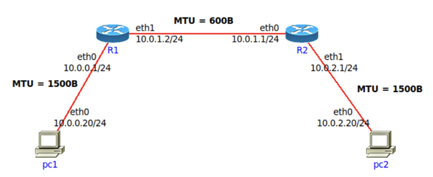
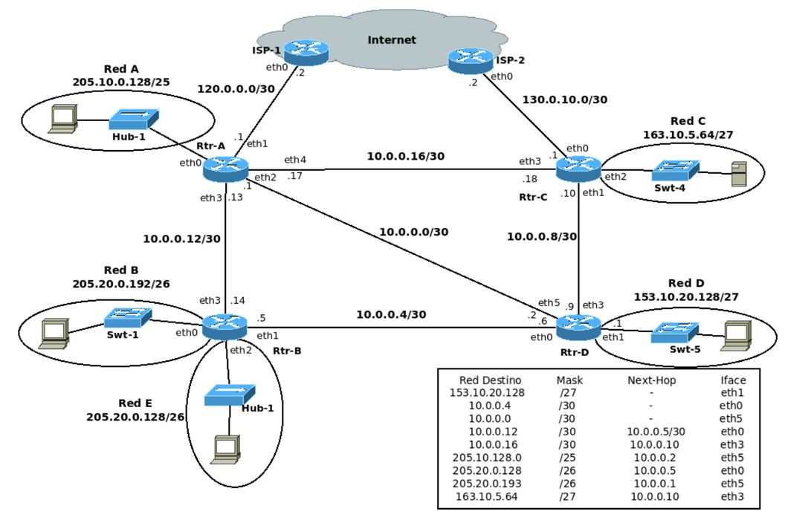
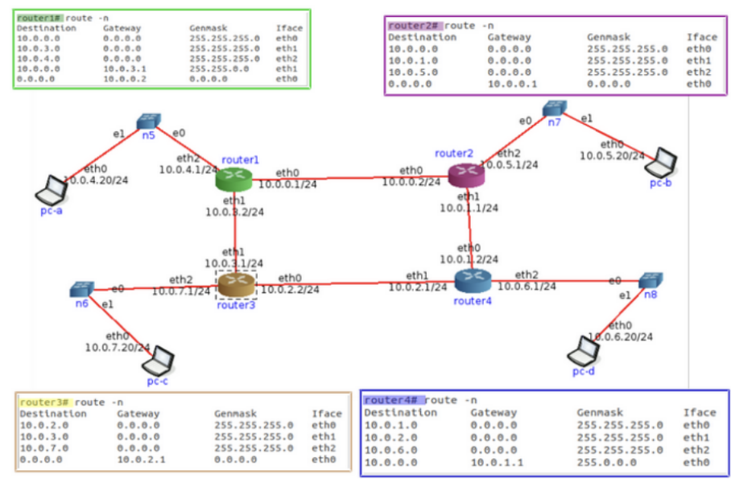
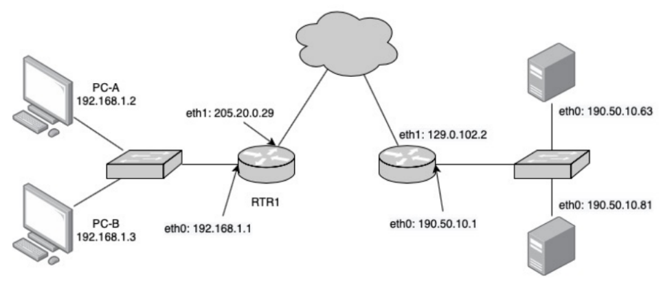
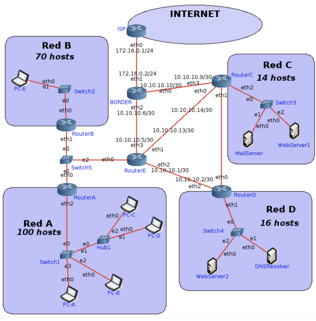
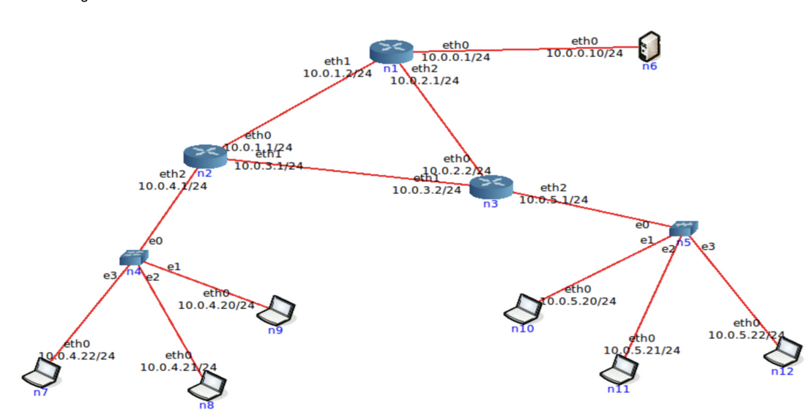

# Práctica 8 - Capa de Red: Fragmentación - Ruteo

# Recomendación

Al final de la práctica se encuentra un ejercicio para ser realizado en la herramienta CORE. Si bien el ejercicio no agrega conceptos nuevos a los vistos previamente, recomendamos su resolución para que puedan configurar, probar y analizar todo lo aprendido en una simulación de una red.

# Fragmentación

## 1. Se tiene la siguiente red con los MTUs indicados en la misma. Si desde pc1 se envía un paquete IP a pc2 con un tamaño total de 1500 bytes (cabecera IP más payload) con el campo Identification = 20543, responder:



## Indicar IPs origen y destino y campos correspondientes a la fragmentación cuando el paquete sale de pc1

## ¿Qué sucede cuando el paquete debe ser reenviado por el router R1?

## Indicar cómo quedarían los paquetes fragmentados para ser enviados por el enlace entre R1 y R2.

## ¿Dónde se unen nuevamente los fragmentos? ¿Qué sucede si un fragmento no llega?

## Si un fragmento tiene que ser reenviado por un enlace con un MTU menor al tamaño del fragmento, ¿qué hará el router con ese fragmento?

# Ruteo

## 2. ¿Qué es el ruteo? ¿Por qué es necesario?

## 3. En las redes IP el ruteo puede configurarse en forma estática o en forma dinámica. Indique ventajas y desventajas de cada método.

## 4. Una máquina conectada a una red pero no a Internet, ¿tiene tabla de ruteo?

## 5. Observando el siguiente gráfico y la tabla de ruteo del router D, responder:



### a. ¿Está correcta esa tabla de ruteo? En caso de no estarlo, indicar el o los errores encontrados. Escribir la tabla correctamente (no es necesario agregar las redes que conectan contra los ISPs)

### b. Con la tabla de ruteo del punto anterior, Red D, ¿tiene salida a Internet? ¿Por qué? ¿Cómo lo solucionaría? Suponga que los demás routers están correctamente configurados, con salida a Internet y que Rtr-D debe salir a Internet por Rtr-C.

### c. Teniendo en cuenta lo aplicado en el punto anterior, si Rtr-C tuviese la siguiente entrada en su tabla de ruteo, ¿qué sucedería si desde una PC en Red D se quiere acceder un servidor con IP 163.10.5.15?

```bash
Red Destino   Mask   Next-Hop   Iface
163.10.5.0    /24    10.0.0.9   eth1
```

### d. ¿Es posible aplicar sumarización en la tabla del router Rtr-D? ¿Por qué? ¿Qué debería suceder para poder aplicarla?

### e. La sumarización aplicada en el punto anterior, ¿se podría aplicar en Rtr-B? ¿Por qué?

### f. Escriba la tabla de ruteo de Rtr-B teniendo en cuenta lo siguiente:

- Debe llegarse a todas las redes del gráfico
- Debe salir a Internet por Rtr-A
- Debe pasar por Rtr-D para llegar a Red D
- Sumarizar si es posible

### g. Si Rtr-C pierde conectividad contra ISP-2, ¿es posible restablecer el acceso a Internet sin esperar a que vuelva la conectividad entre esos dispositivos?

## 6. Evalúe para cada caso si el mensaje llegará a destino, saltos que tomará y tipo de respuesta recibida en el emisor.



- Un mensaje ICMP enviado por PC-B a PC-C.
- Un mensaje ICMP enviado por PC-C a PC-B.
- Un mensaje ICMP enviado por PC-C a 8.8.8.8.
- Un mensaje ICMP enviado por PC-B a 8.8.8.8.

# DHCP y NAT

## 7. Con la máquina virtual con acceso a Internet realice las siguientes observaciones respecto de la autoconfiguración IP vía DHCP:

### a. Inicie una captura de tráfico Wireshark utilizando el filtro bootp para visualizar únicamente tráfico de DHCP.

### b. En una terminal de root, ejecute el comando $ sudo /sbin/dhclient eth0 y analice el intercambio de paquetes capturado.

### c. Analice la información registrada en el archivo /var/lib/dhcp/dhclient.leases, ¿cuál parece su función?

### d. Ejecute el siguiente comando para eliminar información temporal asignada por el servidor DHCP.

```bash
$ rm /var/lib/dhcp/dhclient.leases
```

### e. En una terminal de root, vuelva a ejecutar el comando $ sudo /sbin/dhclient eth0 y analice el intercambio de paquetes capturado nuevamente ¿a que se debió la diferencia con lo observado en el punto “b”?

### f. Tanto en “b” como en “e”, ¿qué información es brindada al host que realiza la petición DHCP, además de la dirección IP que tiene que utilizar?

## 8. ¿Qué es NAT y para qué sirve? De un ejemplo de su uso y analice cómo funcionaría en ese entorno. Ayuda: analizar el servicio de Internet hogareño en el cual varios dispositivos usan Internet simultáneamente.

## 9. ¿Qué especifica la RFC 1918 y cómo se relaciona con NAT?

## 10. En la red de su casa o trabajo verifique la dirección IP de su computadora y luego acceda a www.cualesmiip.com. ¿Qué observa? ¿Puede explicar qué sucede?

## 11. Resuelva las consignas que se dan a continuación.

### a. En base a la siguiente topología y a las tablas que se muestran, complete los datos que faltan.



```bash
PC-A (ss)
Local Address:Port     Peer Address:Port
192.168.1.2:49273      _________________
_________________      190.50.10.63:25
192.168.1.2:_____      190.50.10.81:8080

PC-B (ss)
Local Address:Port     Peer Address:Port
192.168.1.3:52734      _________________
192.168.1.3:39275      _________________

RTR-1 (Tabla de NAT)
Lado LAN               Lado WAN
192.168.1.2:49273      205.20.0.29:25192
192.168.1.2:51238      _________________
192.168.1.3:52734      205.20.0.29:51091
192.168.1.2:37484      205.20.0.29:41823
192.168.1.3:39275      205.20.0.29:9123

SRV-A (ss)
Local Address:Port     Peer Address:Port
190.50.10.63:80        205.20.0.29:25192
190.50.10.63:25        205.20.0.29:41823

SRV-B (ss)
Local Address:Port     Peer Address:Port
190.50.10.81:8080      205.20.0.29:16345
190.50.10.81:8081      205.20.0.29:51091
190.50.10.81:8080      205.20.0.29:9123
```

### b. En base a lo anterior, responda:

#### I. ¿Cuántas conexiones establecidas hay y entre qué dispositivos?

#### II. ¿Quién inició cada una de las conexiones? ¿Podrían haberse iniciado en sentido inverso? ¿Por qué? Investigue qué es port forwarding y si serviría como solución en este caso.

## Ejercicio de repaso



## 12. Asigne las redes que faltan utilizando los siguientes bloques y las consideraciones debajo:

| 226.10.20.128/27 | 200.30.55.64/26 | 127.0.0.0/24    | 192.168.10.0/29 |
| ---------------- | --------------- | --------------- | --------------- |
| 224.10.0.128/27  | 224.10.0.64/26  | 192.168.10.0/24 | 10.10.10.0/27   |

- Red C y la Red D deben ser públicas.
- Los enlaces entre routers deben utilizar redes privadas.
- Se debe desperdiciar la menor cantidad de IP posibles.
- Si va a utilizar un bloque para dividir en subredes, asignar primero la red con más cantidad de hosts y luego las que tienen menos.
- Las redes elegidas deben ser válidas.

## 13. Asigne IP a todas las interfaces de las redes listadas a continuación. Nota: Los routers deben tener asignadas las primeras IP de la red. Para enlaces entre routers, asignar en el siguiente orden: RouterA, RouterB, RouterC, RouterD y RouterE.

- Red A, Red B, Red C y Red D.
- Red entre RouterA-RouterB-RouterE.
- Red entre RouterC-RouterD.

## 14. Realice las tablas de rutas de RouterE y BORDER considerando:

- Siempre se deberá tomar la ruta más corta.
- Sumarizar siempre que sea posible.
- El tráfico de Internet a la Red D y viceversa debe atravesar el RouterC.
- Todos los hosts deben poder conectarse entre sí y a Internet.

# Aclaración importante

En CORE no se guardan los cambios realizados en una topología al detenerla. Por ello, es deseable completar todo el ejercicio una vez empezado, para no tener que volver a configurar todo. Alternativamente se puede utilizar el script que se encuentra en este repositorio https://github.com/RYSAEI SaveRestoreScripts para forzar que se guarden los cambios.

## 15. Utilizando la máquina virtual, se configurará ruteo estático en la red que se muestra en el

siguiente gráfico:



### a. Antes de empezar el ejercicio ejecute en una terminal el siguiente comando:

```bash
$ sudo iptables -P FORWARD ACCEPT
```

### b. Inicie la herramienta CORE y abra el archivo 1-ruteo-estatico.imn.

### c. Inicie la virtualización de la topología.

### d. Analice las tablas de ruteo de las diferentes PCs y de los routers. ¿Qué observa? ¿Puede explicar por qué?

### e. Configure las direcciones IP de las interfaces según lo que muestra el gráfico (para entrar a configurar cada equipo ya sea una PC o un router debe hacer doble click sobre el mismo, lo cual abre una terminal de comandos). Por ejemplo:

- En la PC n6 debe configurar la interfaz eth0 con la IP 10.0.0.10.
- En el Router n1 debe configurar la eth0 con la IP 10.0.0.1, la eth1 con la IP 10.0.1.2 y la eth2 con la 10.0.2.1.

### f. Analice las tablas de ruteo de las diferentes PCs y de los routers. ¿Qué observa? ¿Puede explicar por qué?

### g. Compruebe conectividad. Para ello, tome por ejemplo la PC n7 y haga un ping a cada una de las diferentes IPs que configuró. ¿Qué ocurre y por qué?

### h. Configure una ruta por defecto en todas las computadoras y analice los cambios en las tablas de ruteo.

### i. Compruebe conectividad repitiendo el mismo procedimiento que realizó anteriormente. ¿Qué ocurre y por qué?

### j. Función de ruteo: un dispositivo que actúe como router requiere tener habilitado el encaminamiento de paquetes entre sus interfaces.

- Verificar IP_FORWARD, en los routers y las PCs, obteniendo la configuración con:

```bash
$ cat /proc/sys/net/ipv4/ip_forward
```

El valor 0 indica funcionalidad desactivada (esto es correcto para las PCs). 1 indica que está habilitado (esto es requerido para los routers).

### k. Configure en los routers rutas estáticas a cada una de las redes de la topología (no utilice rutas por defecto).

### l. Compruebe conectividad entre todos los dispositivos de la red. Si algún dispositivo no puede comunicarse con otro revise las tablas de ruteo y solucione los inconvenientes hasta que la conectividad sea completa.

### m. Modifique ahora las tablas de ruteo de los routers, eliminando todas las rutas configuradas hasta el momento y vuelva a configurarlas en base al siguiente criterio.

- Router n1 envía todo el tráfico desconocido a Router n2.
- Router n2 envía todo el tráfico desconocido a Router n3.
- Router n3 envía todo el tráfico desconocido a Router n1.

### n. Compruebe conectividad entre todos los dispositivos de la red. Si algún dispositivo no puede comunicarse con otro revise las tablas de ruteo y solucione los inconvenientes hasta que la conectividad sea completa.

### o. En base a las dos configuraciones de las tablas de ruteo anteriores, responda:

- ¿Cuál opción le resultó más sencilla y por qué?
- Considerando el tamaño de las tablas de ruteo en cada situación, ¿cuál de las dos opciones le parece más conveniente y por qué?
- ¿Puede pensar en algún caso donde la segunda opción sea la única posible?
- Suponga que realiza un ping a un host que tiene la IP 190.50.12.34. ¿Qué ocurrirá en cada caso? ¿Cuál le parece mejor?
