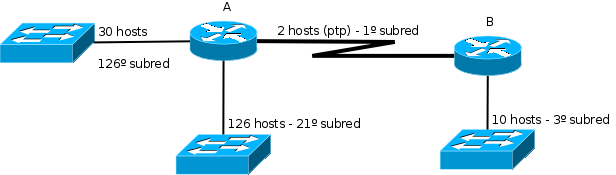
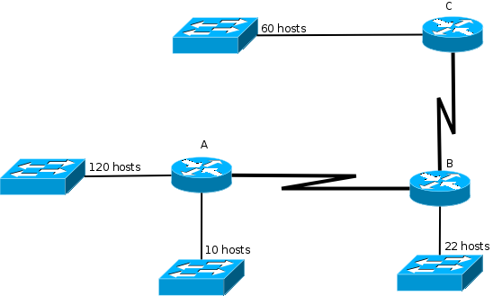

# Guía de subnetting

## 1. Objetivo

El objetivo de este documento es explicar cómo realizar una división en subredes, comenzando desde los aspectos básicos y llegando a incluir temas avanzados como VLSM y CIDR.

## 2. Marco teórico

**Cuadro 1: Redes por clase**

| Clase | Primero octeto | Rango                       | Objetivo                                                  | Cantidad Redes | Cantidad Hosts |
| ----- | -------------- | --------------------------- | --------------------------------------------------------- | -------------- | -------------- |
| A     | 0xxxxxxx       | 0.0.0.0 - 127.255.255.255   | Organizaciones con grandes cantidades de hosts            | 2^7            | (2^24) - 2     |
| B     | 10xxxxxx       | 128.0.0.0 - 191.255.255.255 | Organizaciones de tamaño mediano y grande                 | 2^14           | (2^16) - 2     |
| C     | 110xxxxx       | 192.0.0.0 - 223.255.255.255 | Pequeñas redes                                            | 2^21           | (2^8) - 2      |
| D     | 1110xxxx       | 224.0.0.0 - 239.255.255.255 | Direcciones de multicast                                  | -              | -              |
| E     | 1111xxxx       | 240.0.0.0 - 255.255.255.255 | Direcciones reservadas (para investigación y otros fines) | -              | -              |

El problema que surgió fue que las clases A y B se agotaron muy rápidamente, con lo cuál el número de direcciones IP disponibles se redujo drásticamente. El gran problema de las clases es que la diferencia de hosts que cada una admite es muy grande entre sí. Para entenderlo mejor, servirá un ejemplo: Se tiene una organización con 1000 hosts en su red. Una red de clase C no satisface sus necesidades, dado que admite como máximo 254 hosts. Entonces, la siguiente opción es una clase B, que tiene una capacidad de direccionamiento de 65.534 hosts. Por lo tanto la organización desperdiciará 64.534 direcciones IP, ¡lo que representa el 98,47% de las direcciones!

NOTA: en las redes de clase A listadas se incluyen la 0.0.0.0 y la 127.0.0.0, que en realidad están reservadas y no pueden utilizarse, dado que tienen un significado especial. La primer dirección hace referencia a la ruta por defecto y la segunda al equipo local.

## 3. Motivación

Se hizo evidente que la asignación basada en clases era ineficiente para la asignación de direcciones de red. Por ello se pensó una estrategia para reducir al mínimo el desperdicio de direcciones IP y fue así como se creó el concepto de subnetting.

## 4. ¿En qué consiste la división en subredes?

Básicamente, la división en subredes plantea que si una red de clase desperdicia muchas direcciones IP entonces la misma sea dividida en N subredes más pequeñas que aprovechen mejor el espacio de direccionamiento. La forma más sencilla de entender esto es con un ejemplo. Suponiendo el caso de la organización anterior para la cuál una red de clase C es muy chica y, a su vez, una red de clase B es demasiado grande, entonces se puede dividir la red de clase B en redes más chicas que se ajusten más a las realidades de la organización. De esta manera se podría, por ejemplo, dividir una red de clase B en 64 subredes de 1024 hosts cada una (en realidad 1022, pues la primer y última dirección no pueden utilizarse para hosts). De esta forma, la organización que antes desperdiciaba el 98,47% de sus direcciones IP ahora desperdiciará sólo el 2,34% y quedará la posibilidad de tener direcciones para otras 63 organizaciones de similar tamaño.

## 5. Concepto de máscara de subred

El concepto de máscara indica en una dirección IP qué bits son de red y qué bits son de host. Con el uso de redes con clases, la máscara estaba implícita en la dirección de clase, pues se conocía a priori los bits para red y los bits para host. Cuando se creó el concepto de subredes también se les asoció una máscara de subred, que resultó de utilizar algunos bits de hosts para crear subredes y de esta manera obtener varias subredes con menos hosts cada una.

## 6. Mecanismo de subnetting

Partiendo de una red dada, para obtener dos subredes será necesario un único bit, ya que con él pueden representarse dos números. Si fueran necesarias tres subredes ya se necesitaría un bit más, que daría como resultado la posibilidad de obtener cuatro subredes. Lógicamente, al utilizar bits de hosts para crear subredes, cuantas más subredes se necesiten menos hosts podrá albergar cada una. Con la pequeña introducción teórica ya vista se analizará el procedimiento de subnetting utilizando un ejemplo. Para ello, se utilizará una empresa ficticia que está dividida en 4 áreas con 55 hosts cada una y cuenta con la red 192.10.10.0. En primera instancia lo conveniente es tomar la red asignada y escribirla, junto con su máscara, en números binarios. Así, la red anterior, que según la tabla es una clase C y su máscara es 255.255.255.0 se escribe como:

```bash
11000000 00001010 00001010 00000000 - Dirección de red
11111111 11111111 11111111 00000000 - Máscara
rrrrrrrr rrrrrrrr rrrrrrrr hhhhhhhh - r: representa porción de red
                                      h: representa porción de host
```

Ahora bien, según los requerimientos se necesitan cuatro subredes (una para cada área de la empresa) por lo cuál deberán tomarse dos bits de la parte de host para representarlas. Entonces lo anterior se podría dividir de la siguiente manera:

```bash
11000000 00001010 00001010 00000000 - Dirección de red
11111111 11111111 11111111 11000000 - Máscara
rrrrrrrr rrrrrrrr rrrrrrrr sshhhhhh - r: representa porción de red
                                      s: representa porción de subred
                                      h: representa porción de host
```

Notar que ahora, los dos bits más significativos de la parte de host forman parte de la máscara de subred. Con ello, hay 2 bits para subred lo que hace un total de 4 subredes y 6 bits para hosts, lo que significa un total de 64 hosts (62 en realidad). ¿Qué habría pasado si el requerimiento hubiera sido 4 subredes con 70 hosts cada una y la clase C dada? Simplemente no podría haberse satisfecho porque no hay manera que las direcciones IP sean suficientes.

## 7. Cálculo de cantidad de subredes y hosts

Un cálculo muy común al realizar subnetting es el de computar la cantidad de hosts y de subredes que pueden obtenerse cuando se divide en subredes. Las cuentas son realmente simples y se basan en las siguientes fórmulas:

**Cantidad de subredes utilizando bs bits para subred**

```math
2^bs
```

**Cantidad de hosts utilizando bh bits para hosts**

```math
(2^bs) - 2
```

El motivo por el cuál se restan los dos bits en la última fórmula es porque la primer y última IP de una subred no pueden utilizarse, debido a que la primer dirección es la dirección de subred y la última la de broadcast.

## 8. Tabla de potencias de 2

A continuación se presenta una tabla con los resultados para cada potencia de 2, abarcando desde el 1 hasta el 12. Será de gran utilidad para los primeros cálculos y con la práctica ya no será necesaria.

**Cuadro 2: Tabla de potencias de 2**

| Bits(X) | Resultado |
| ------- | --------- |
| 1       | 2         |
| 2       | 4         |
| 3       | 8         |
| 4       | 16        |
| 5       | 32        |
| 6       | 64        |
| 7       | 128       |
| 8       | 256       |
| 9       | 512       |
| 10      | 1024      |
| 11      | 2048      |
| 11      | 4096      |

## 9. Cálculo de máscara de subred sabiendo la cantidad de subredes necesarias

El primer caso simple es, dada una cantidad de subredes, obtener la cantidad de bits necesarios para la máscara de subred. Por ejemplo, si se tiene la subred 170.25.0.0 y se necesitan crear 27 subredes se requiere calcular cuántos bits se necesitan para representar el número 27. Para ello se puede buscar en la tabla anterior encontrando que con 4 bits es posible representar 16 direcciones (no alcanza) y con 5 bits se obtienen 32 direcciones. Entonces, la máscara se transformará en:

```bash
10101010 00011001 00000000 00000000 - 170.25.0.0
11111111 11111111 00000000 00000000 - Máscara original
11111111 11111111 11111000 00000000 - Máscara de subred
```

La máscara anterior en decimal sería 255.255.248.0.

## 10. Cálculo de máscara de subred sabiendo la cantidad de hosts

Para calcular la máscara en base a la cantidad de hosts el mecanismo es muy similar al anterior con una consideración más y es que al valor de la tabla es necesario restarle 2 unidades (por las direcciones de subred y de broadcast). Tomando como ejemplo una organización que cuenta con la clase B 181.67.0.0 y está dividida en varias áreas donde la más grande de ellas tiene 500 hosts, se debe calcular cuántos bits destinar a host. Buscando en la tabla se ve que la opción adecuada es utilizar 9 bits que nos da un total de 510 hosts. La diferencia fundamental respecto del cálculo que hicimos en el punto anterior, es que la máscara saldrá como resultado de fijar los bits de host, que se cuentan desde la derecha. Entonces, este cálculo sería de la siguiente manera.

```bash
10110101 01000011 00000000 00000000 - 181.67.0.0
11111111 11111111 00000000 00000000 - Máscara original
11111111 11111111 11111110 00000000 - Máscara de subred
```

Notar que dejamos 9 bits en 0 desde la derecha y el resto de los bits los pusimos en 1. La máscara anterior, en decimal, es 255.255.254.0.

## 11. Calcular la n-ésima subred

Suponiendo que se cuenta con la red de clase A 20.0.0.0 y se necesitan 4000 subredes. Siguiendo los pasos que se han realizado hasta el momento se necesitarían 12 bits para obtener 4096 subredes, con lo que se obtendría lo siguiente:

```bash
00010100 00000000 00000000 00000000 - 20.0.0.0
11111111 00000000 00000000 00000000 - 255.0.0.0 - Máscara por defecto
11111111 11111111 11110000 00000000 - 255.255.240.0 - Máscara de subred
```

Ahora bien, puede resultar necesario en algún caso obtener la dirección de una subred específica. Para ello se realiza una cuenta muy simple que consiste en representar el número de subred que desea obtenerse menos uno en la parte que corresponde a los bits asignados para subred. El motivo por el cuál se resta uno al número de subred es porque la primer subred válida es la red 0. Esto se entiende mucho mejor con un ejemplo. Para obtener la 2000º subred con la división en subredes hechas en el ejemplo anterior se deben realizar los siguientes pasos:

- Escribir el número 1999 en binario.

```bash
011111001111
```

- Ubicar el número obtenido en la dirección IP ocupando la posición de los bits asignados a subred (se realiza en la segunda línea). Se puede ver que ya se separa el número en dos octetos, utilizando los ocho bits superiores para el segundo octeto y los cuatro inferiores como los cuatro superiores del tercer octeto. El resto de los bits se dejan en cero pues son los que corresponden a host.

```bash
00010100 00000000 00000000 00000000 - 20.0.0.0 - Dirección de red
00010100 01111100 11110000 00000000 - 20.124.240.0 - Dirección de subred
11111111 11111111 11110000 00000000 - 255.255.240.0 - Máscara de subred
```

12. Ejemplo integrador

Se tiene la red de clase B 146.201.0.0 y se la desea subnetear para el siguiente esquema. Tener en cuenta que el número de hosts que se especifica incluye la dirección IP de los routers.



Los pasos a seguir son:

1. Decidir la máscara de subred que se va a aplicar a las subredes.
2. Especificar la cantidad de subredes que pueden obtenerse y la cantidad de hosts que pueden direccionarse por subred.
3. Calcular las redes que se piden.
4. Asignar las redes para adaptarse a lo solicitado.
5. Designar una IP para los routers (suelen utilizarse la primera o última IP del rango). La resolución se haría de la siguiente manera.

### 12.1. Decisión de la máscara de subred

Para decidir la máscara de subred que se va a utilizar pueden escogerse dos criterios:

- Tomando la subred con mayor cantidad de hosts y utilizando dicha información para calcular los bits necesarios para hosts. De ahí es trivial obtener los bits para subred y, con ellos, la máscara de subred.
- Tomando la cantidad de subredes necesarias y eligiendo la cantidad de bits que se necesitan para representarlas.

En este caso, dado que se provee la información de la red con mayor cantidad de hosts se va a utilizar ese criterio para elegir la máscara de subred. Para ello, se ve que la subred más grande tiene 126 hosts. Según la tabla, se necesitarían 7 bits para cubrir el espacio de direcciones de dicha subred. Entonces:

```bash
10010010 11001001 00000000 00000000 - 146.201.0.0 - Dirección de red
11111111 11111111 00000000 00000000 - 255.255.0.0 - Máscara de red
11111111 11111111 11111111 10000000 - 255.255.255.128 - Máscara de subred
```

La máscara anterior surgió de utilizar 7 bits para hosts (los últimos 7 bits de la dirección) y el resto asignarlos a subred.

### 12.2. Cantidad de subredes y de hosts por subred

Según lo visto anteriormente, para obtener la cantidad de subredes es necesario elevar 2 a la cantidad de bits para subred. Se puede ver que se cuenta con 9 bits para subred, por lo tanto:

```math
2^9 = 512
```

Es así que se puede concluir en que se podrán obtener 512 subredes. La cantidad de hosts por subred ya está calculada, dado que fue el criterio que se utilizó para obtener la máscara de subred. No obstante, para seguir los pasos del procedimiento se muestra el cálculo. Lo que debe hacerse es elevar 2 a la cantidad de bits utilizados para hosts y, al resultado, restarle dos unidades.

```math
2^7 - 2 = 126
```

Por lo tanto, se concluye que se podrán tener 512 subredes donde cada una de ellas será capaz de albergar un máximo de 126 hosts.

**NOTA:** es importante notar que cuando se escogió utilizar 7 bits para hosts no queda ninguna dirección IP libre en la subred de mayor tamaño, lo que puede ser un problema si se necesita agregar un nuevo host más tarde a la misma. En ese caso podría tomarse 1 bit más para poder afrontar un crecimiento futuro, aunque desperdiciando muchas direcciones IP. No existe una regla para decidir, dependerá del espacio de direcciones con el que se cuente, de la proyección de crecimiento y otros factores más. De cualquier manera, siempre es recomendable dejar algunas direcciones IP libres en cada red.

### 12.3. Cálculo de subredes solicitadas

El próximo paso es calcular qué subred corresponde con cada una de las que se pide utilizar. Recordando lo visto, se debe restar una unidad a la subred a obtener, representar ese número en binario (utilizando todos los bits dedicados a subred) y luego colocarlo en la posición de los bits de subred. Entonces:

- 1º subred: 000000000.

```bash
10010010 11001001 00000000 00000000 - 146.201.0.0 - Dirección de 1º subred
11111111 11111111 11111111 10000000 - 255.255.255.128 - Máscara de subred
```

- 3º subred: 000000010.

```bash
10010010 11001001 00000001 00000000 - 146.201.1.0 - Dirección de 3º subred
11111111 11111111 11111111 10000000 - 255.255.255.128 - Máscara de subred
```

- 21º subred: 000010100.

```bash
10010010 11001001 00001010 00000000 - 146.201.10.0 - Dirección de 21º subred
11111111 11111111 11111111 10000000 - 255.255.255.128 - Máscara de subred
```

- 126º subred: 001111101.

```bash
10010010 11001001 00111110 10000000 - 146.201.62.128 - Dirección de 126º subred
11111111 11111111 11111111 10000000 - 255.255.255.128 - Máscara de subred
```

### 12.4. Asignación de IPs a los routers

Para asignar las IPs se utilizará la primera de cada subred, excepto en el caso de las punto a punto. Así las asignaciones serán:

- Router A:
    - 146.201.0.1
    - 146.201.10.1
    - 146.201.62.129

- Router B:
    - 146.201.0.2
    - 146.201.1.1

## 13. CIDR

El concepto de CIDR (classless inter-domain routing) se definió en la RFC 1519 como una estrategia para frenar algunos problemas que se habían comenzado a manifestar con el crecimiento de Internet. Los mismos son:

- Agotamiento del espacio de direcciones de clase B.
- Crecimiento de las tablas de enrutamiento más allá de la capacidad del software y hardware disponibles.
- Eventual agotamiento de las direcciones IP en general.

CIDR consiste básicamente en permitir máscaras de subred de longitud variable (VLSM) para optimizar la asignación de direcciones IP y utilizar resumen de rutas para disminuir el tamaño de las tablas de enrutamiento.

## 14. VLSM

La técnica de VLSM (variable-length subnet masking) consiste en realizar divisiones en subredes con máscaras de longitud variable y es otra de las técnicas surgidas para frenar el agotamiento de direcciones IPv4. Básicamente, VLSM sugiere hacer varios niveles de división en redes para lograr máscaras más óptimas para cada una de las subredes que se necesiten. Trabajando con el ejemplo anterior puede verse que hay 512 subredes con la capacidad de contener 126 hosts cada una. Suponiendo que, excepto la única área que tiene 126 hosts, las demás áreas no tienen más de 30 hosts se estarían desperdiciando entonces alrededor de 90 direcciones IP por subred. También podría darse la situación de, aún teniendo direcciones IP suficientes, no puedan direccionarse todos los hosts. Nuevamente, se va a trabajar con un ejemplo. Dada la siguiente topología de red, se tiene para asignar direcciones la clase C 199.210.66.0.



Si se utilizara el esquema tradicional de división en subredes no sería posible asignar direcciones a todos los hosts, ya que al dividir las subredes para soportar la que requiere 120 hosts quedarían tan sólo dos redes de 126 hosts cada una. Con VLSM es posible asignar direcciones para todos los hosts en el esquema anterior haciendo divisiones sucesivas en subredes más pequeñas. Los pasos para dividir en subredes utilizando VLSM son:

- Subnetear para la red con mayor cantidad de hosts.
- De las subredes obtenidas, asignar todas las que se puedan con el menor desperdicio posible.
- Si aún quedan segmentos de red sin una subred asignada volver al paso 1.

Con el algoritmo anterior se dividiría entonces de la siguiente manera:

1. Tomar el segmento con 120 hosts y subnetear para él. Se necesitan 7 bits para 126 hosts, lo cuál queda bien para este caso. Entonces:

```bash
11000111 11010010 01000010 00000000 - 199.210.66.0 - Dirección de clase
11111111 11111111 11111111 00000000 - 255.255.255.0 - Máscara de red
11111111 11111111 11111111 10000000 - 255.255.255.128 - Máscara de subred
```

Se ve que se utilizaron 7 bits para hosts (para direccionar 126 hosts) y quedó tan sólo 1 bit para subred, por lo que se podrán obtener sólo 2 subredes. Lo que se hará en este caso es asignar la primera de las subredes al segmento con 120 hosts y la otra se volverá a dividir. Entonces:

- 199.210.66.0/255.255.255.128 - Red de 120 hosts.
- 199.210.66.128/255.255.255.128 - Red a subnetear nuevamente.

2. Tomar el segmento con 60 hosts y subnetear para él. Se necesitan 6 bits para 62 hosts, por lo que se utilizarán 6 bits. Quedaría:

```bash
11000111 11010010 01000010 10000000 - 199.210.66.128 - Dirección de subred
11111111 11111111 11111111 10000000 - 255.255.255.128 - Máscara de subred
11111111 11111111 11111111 11000000 - 255.255.255.192 - Nueva máscara de subred
```

En este caso se utilizaron 6 bits para hosts y quedó 1 bit para subred, por lo que será posible obtener 2 subredes de 62 hosts cada una. El siguiente paso es asignar una de ellas al segmento con 60 hosts:

- 199.210.66.128/255.255.255.192 - Red de 60 hosts.
- 199.210.66.192/255.255.255.192 - Red a subnetear nuevamente.

3. Tomar el segmento con 22 hosts y subnetear para él. Se necesitan 5 bits para 30 hosts. El resultado será:

```bash
11000111 11010010 01000010 11000000 - 199.210.66.192 - Dirección de subred
11111111 11111111 11111111 11000000 - 255.255.255.192 - Máscara de subred
11111111 11111111 11111111 11100000 - 255.255.255.224 - Nueva máscara de subred
```

En la división anterior se utilizaron 5 bits para hosts y nuevamente quedó 1 bit para subred, por lo que será posible obtener 2 subredes de 30 hosts cada una. Nuevamente se asigna una de ellas al segmento de 22 hosts y la otra se volverá a subnetear:

- 199.210.66.192/255.255.255.224 - Red de 22 hosts.
- 199.210.66.224/255.255.255.224 - Red a subnetear nuevamente.

4. Tomar el segmento con 10 hosts y subnetear para él. Se necesitan 4 bits para 14 hosts. Se obtendrá lo siguiente:

```bash
11000111 11010010 01000010 11100000 - 199.210.66.224 - Dirección de subred
11111111 11111111 11111111 11100000 - 255.255.255.224 - Máscara de subred
11111111 11111111 11111111 11110000 - 255.255.255.240 - Nueva máscara de subred
```

Se ve que se utilizaron 4 bits para hosts y quedó 1 bit para subred, con lo que se tendrán 2 subredes de 14 hosts cada una. Ya casi terminando, se asigna una de las subredes al segmento con 10 hosts y se deja la otra para subnetear nuevamente para los enlaces punto a punto.

- 199.210.66.224/255.255.255.240 - Red de 10 hosts.
- 199.210.66.240/255.255.255.240 - Red a subnetear nuevamente.

5. Para terminar se tomarán los dos enlaces entre los routers. Se necesita que cada enlace tenga dos hosts como máximo, con lo cual se utilizarán sólo 2 bits, quedando 2 bits para subred. Así:

```bash
11000111 11010010 01000010 11110000 - 199.210.66.240 - Dirección de subred
11111111 11111111 11111111 11110000 - 255.255.255.240 - Máscara de subred
11111111 11111111 11111111 11111100 - 255.255.255.252 - Nueva máscara de subred
```

En este caso se utilizaron 2 bits para hosts y quedaron 2 bits para subred, con lo que se tendrán 4 subredes de 2 hosts cada una. En este punto ya no se puede volver a hacer una división de subred, pero sí quedarán 2 redes con 2 hosts cada una libres para una futura asignación.

- 199.210.66.240/255.255.255.252 - Enlace entre router A y B.
- 199.210.66.244/255.255.255.252 - Enlace entre router B y C.
- 199.210.66.248/255.255.255.252 - Red libre.
- 199.210.66.252/255.255.255.252 - Red libre.

Se puede resumir lo realizado en un esquema que suele resultar útil para utilizar mientras se realiza el proceso:

```bash
199.210.66.0/24
    => 199.210.66.0/25: asignada.
    => 199.210.66.128/25: se vuelve a dividir.
        => 199.210.66.128/26: asignada.
        => 199.210.66.192/26: se vuelve a dividir.
            => 199.210.66.192/27: asignada.
            => 199.210.66.224/27: se vuelve a dividir.
                => 199.210.66.224/28: asignada.
                => 199.210.66.240/28: se vuelve a dividir.
                    => 199.210.66.240/30: asignada.
                    => 199.210.66.244/30: asignada.
                    => 199.210.66.248/30: libre.
                    => 199.210.66.252/30: libre.
```

Para concluir se ve que partiendo de poder direccionar sólo dos de los segmentos se pasó a direccionar todos y hasta quedando con dos redes punto a punto libres. Esto implica un gran ahorro de direcciones.

## 15. Resumen de rutas

El resumen de rutas se conoce también como agregación de prefijos y consiste básicamente en tomar una cantidad de direcciones de subred y resumirlas en una sola. La principal utilidad del mismo es reducir las tablas de ruteo, ya que en lugar de una entrada por cada subred se tiene una sola entrada de “superred”.

Por ejemplo, para el caso anterior, el router de borde de la organización podría publicar a su ISP las redes:

- 199.210.66.0/25
- 199.210.66.128/26
- 199.210.66.192/27
- 199.210.66.224/28
- 199.210.66.240/30
- 199.210.66.244/30
- 199.210.66.248/30
- 199.210.66.252/30

O simplemente publicar la dirección de red que las resume a todas ellas, que es la red:

- 199.210.66.0/24

Se ve claramente que se redujeron las rutas publicadas de 8 entradas a sólo 1. ¡Y esto para una red muy pequeña! Si esto se lleva a gran escala, como es el caso de Internet, la reducción de las tablas de ruteo con el esquema anterior es realmente drástica. Las ventajas de una tabla de ruteo más pequeña son claras:

- Los routers requieren menos memoria para almacenar la tabla.
- Se ahorra mucho procesamiento al buscar en una tabla de ruteo reducida.
- Los retrasos por enrutamiento son menores.

El procedimiento es el siguiente:

1. Las redes a resumir deben ser consecutivas.
2. Se escriben las direcciones IP y se arma la máscara con unos en todos los lugares donde coincidan los bits de las direcciones.
3. Se hace un AND con cualquiera de las direcciones IP y la máscara obtenida y el resultado, junto con la máscara obtenida, será la ruta de resumen.

Ejemplo: se tienen las siguientes cuatro subredes consecutivas y se las quiere resumir en una sola.

- 192.168.0.0/24
- 192.168.1.0/24
- 192.168.2.0/24
- 192.168.3.0/24

```bash
11000000 10101000 00000000 00000000 - 192.168.0.0
11000000 10101000 00000001 00000000 - 192.168.1.0
11000000 10101000 00000010 00000000 - 192.168.2.0
11000000 10101000 00000011 00000000 - 192.168.3.0

11111111 11111111 11111100 00000000 - 255.255.248.0
```

Se ve que las cuatro redes anteriores pueden resumirse con la dirección de superred 192.168.0.0/22.
